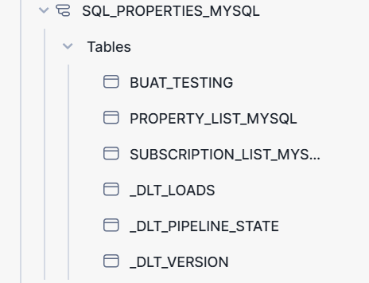
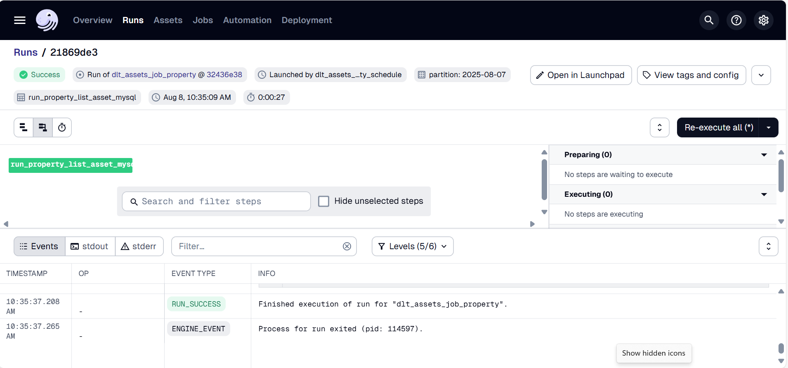
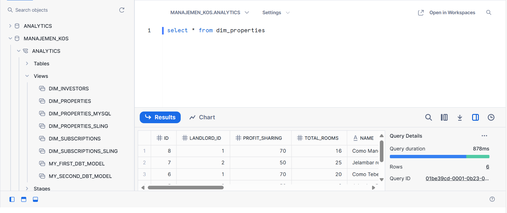

# Prequisites
## Tools
```
1.  Snowflake 
    akun free trial bisa, jangan menggunakan region middle east central karena tidak tersedia dbt partner connect
2. DLT
3. Dagster
4. DBT
5. MySQL
6. DuckDB (opsional, kalau mau testing dengan database yang ringan)
7. DBeaver
8. Google Service Account dari Google Cloud (Opsional, kalau mau melakukan extract dan load dari drive/sheets)
```

## Libraries
```
sqlalchemy
humanize
dlt
mysqlclient
dagster
requests
python-dotenv
urllib3
google-api-python-client
google-auth
pandas
duckdb
pymysql
dbt-core
dbt-snowflake
dagster-webserver
```
## Inisiasi
1. Dagster
    Pastikan kamu sudah di root project, lalu inisiasi directory menggunakan
    ```bash
    uvx -U create-dagster project my-project
    ```

    Setelah dijalankan, akan terbentuk directory file. Namun perlu diketahui untuk project ini, kita perlu menambahkan beberapa file dan folder. Sehingga hasil akhirnya akan menjadi
    ```
    .
    └── my-project
    ├── pyproject.toml
    ├── src
    │   └── my_project
    │       ├── __init__.py
    │       ├── definitions.py
    │       └── defs
    │           └── __init__.py
    │           └── jobs.py             -> Manual
    │           └── resources.py        -> Manual, digunakan untuk menyambungkan dbt dengan dagster
    │           └── schedules.py        -> Manual
    │           └── partitions.py       -> Manual
    │           └── assets              -> Manual
    │               └── kos.py          -> Manual, mendefinisikan asset DLT
    │               └── dbt.py          -> Manual, mendefinisikan asset DBT
    ├── tests
    │   └── __init__.py
    └── uv.lock
    ```

2. Service Account (Kalau mau melakukan Extract dan Load dari Google Drive/Sheets)
    - Buat akun di https://console.cloud.google.com/
    - Buat project baru
    - Aktifkan API yang dibutuhkan (Google Sheets API)
    - Buat service account baru
    - Dapatkan service_account.json pada tab Key, create new key, json
    - Masukkan file .json tersebut ke dalam directory project

3. DLT
    - Buat folder baru bernama dlt_pipeline dalam folder my-project (**bukan** yang di dalam folder src dagster)
    - Buat file baru bernama kos_pipeline.py dan kos_mysql_pipeline.py di dalam folder tersebut
    - Jalankan 
        ```bash
        dlt init mysql snowflake
        ```
        untuk membuat folder .dlt yang berisi secrets.toml dan config.toml
    - Buka file secrets.toml dan masukkan credential akun snowflake dan mysql
    - Buka website snowflake dan jalankan query untuk membuat akun dlt_loader_role dan memberikan ijin untuk memanipulasi snowflake
    ```sql
    CREATE DATABASE MANAJEMEN_KOS;
    CREATE USER loader WITH PASSWORD='<password>';
    CREATE ROLE DLT_LOADER_ROLE;
    GRANT ROLE DLT_LOADER_ROLE TO USER loader;
    GRANT USAGE ON DATABASE MANAJEMEN_KOS TO DLT_LOADER_ROLE;
    GRANT CREATE SCHEMA ON DATABASE MANAJEMEN_KOS TO ROLE DLT_LOADER_ROLE;
    GRANT USAGE ON WAREHOUSE COMPUTE_WH TO DLT_LOADER_ROLE;
    GRANT ALL PRIVILEGES ON FUTURE SCHEMAS IN DATABASE MANAJEMEN_KOS TO DLT_LOADER_ROLE;
    GRANT ALL PRIVILEGES ON FUTURE TABLES IN DATABASE MANAJEMEN_KOS TO DLT_LOADER_ROLE;
    ```
    - Jangan lupa berikan privileges juga untuk role yang kamu gunakan biasanya di snowflake (pada kasus ini, ACCOUNTADMIN)
    ``` sql
    GRANT USAGE ON DATABASE MANAJEMEN_KOS TO ACCOUNTADMIN;
    GRANT CREATE SCHEMA ON DATABASE MANAJEMEN_KOS TO ROLE ACCOUNTADMIN;
    GRANT USAGE ON WAREHOUSE COMPUTE_WH TO ACCOUNTADMIN;
    GRANT ALL PRIVILEGES ON FUTURE SCHEMAS IN DATABASE MANAJEMEN_KOS TO ACCOUNTADMIN;
    GRANT ALL PRIVILEGES ON FUTURE TABLES IN DATABASE MANAJEMEN_KOS TO ACCOUNTADMIN;

    GRANT SELECT ON TABLE MANAJEMEN_KOS.RAW_SUBSCRIPTIONS.SUBSCRIPTION_LIST TO ROLE ACCOUNTADMIN;
    ```

    Berikut hasil akhir dari directory DLT dalam project
    ```
    └── my-project
        ├── .dlt
        │   └── config.toml
        │   └── secrets.toml
        ├── dlt_pipeline
        │   └── kos_pipeline.py
        │   └── kos_mysql_pipeline.py
    ```

4. DBT
    - Melakukan inisiasi dengan menjalankan
    ```bash
    dbt init property_management
    ```
    - Pada saat pertama kali inisiasi, biasanya ada file dummy models dbt, file tersebut boleh dihapus saja
    - Tambahkan file __sources.yml dan schema.yml dalam folder models dan tambahkan profiles.yml dalam root DBT project property_management dan setting masing-masing file sesuai kebutuhan
    - Tambahkan file models sql yang dibutuhkan (dim_subscriptions.sql dan dim_properties.sql)
    - Jalankan dbt parse dan dbt build dalam property_management

    Berikut hasil akhir dari directory DBT dalam project:
    ```
    ├── project_management
    │   └── analyses
    │   └── logs
    │   └── macros
    │   └── models
    │        └── __sources.yml              
    │        └── schema.yml                
    │        └── dim_properties.sql         
    │        └── dim_subscriptions.sql      
    │   └── seeds
    │   └── snapshots
    │   └── target
    │   └── tests
    │   └── .gitignore
    │   └── dbt_project.yml
    │   └── profiles.yml

    ```

5. .env
    Isi dengan BASE_URL dan API_KEY untuk mengakses API yang ingin diambil datanya

directory keseluruhan project
```
.
└── my-project
   ├── pyproject.toml
   ├── src
   │   └── my_project
   │       ├── __init__.py
   │       ├── definitions.py
   │       └── defs
   │          └── __init__.py
   │          └── jobs.py                 
   │          └── resources.py            
   │          └── schedules.py            
   │          └── partitions.py           
   │          └── assets
   │             └── kos.py
   │             └── dbt.py                  
   ├── tests
   │   └── __init__.py
   └── uv.lock
   ├── .dlt
   │   └── config.toml
   │   └── secrets.toml
   ├── dlt_pipeline
   │   └── kos_pipeline.py
   ├── .sling                             
   │   └── env.yml                        
   ├── project_management
   │   └── analyses
   │   └── logs
   │   └── macros
   │   └── models
   │        └── __sources.yml              
   │        └── schema.yml                
   │        └── dim_properties.sql         
   │        └── dim_subscriptions.sql      
   │   └── seeds
   │   └── snapshots
   │   └── target
   │   └── tests
   │   └── .gitignore
   │   └── dbt_project.yml
   │   └── profiles.yml    
   
```

# Alur kerja
## Extract dan Load data menggunakan DLT
Disini sebenarnya jenis pipeline yang dibuat dibagi 2 berdasarkan source dan destination:
1. API -> Snowflake     (disimpan dalam kos_pipeline.py)
2. MySQL -> Snowflake   (disimpan dalam kos_mysql_pipeline.py)

### Metode
#### API -> Snowflake
1. Membuat resources
```py
    while True:
        response = requests.get(
            f"{BASE_URL}/api/properties",
            headers={"X-API-Key": API_KEY},
            params={"page": page, "limit": 10, "city": "Jakarta"},
            verify=False
        )
        raw = response.json()
        items = raw.get("data", {}).get("data", [])
        print(f"Page {page} - {len(items)} records")
        if not items:
            break
        yield items
        page += 1
```

Penjelasan logika:
- Function akan mengambil data dari api properties selama page yang dituju belum habis

2. Menjalankan pipeline untuk melakukan loading data ke dalam snowflake
```py
    pipeline = dlt.pipeline(
        pipeline_name="properties",
        destination="snowflake",
        dataset_name="raw_properties"
    )
```
Setelah dijalankan, di dalam snowflake akan terbentuk schema baru bernama raw_properties. Sama seperti dataset_name

#### MySQL -> Snowflake
Pada proses extract dan load yang satu ini, tidak digunakan decorator @resource. Metode yang digunakan mengikuti dokumentasi dari DLTHub yang bisa diakses di https://dlthub.com/docs/pipelines/sql_database_mysql/load-data-with-python-from-sql_database_mysql-to-snowflake

Step:
1. Membuat function untuk replikasi keseluruhan database MySQL ke dalam Snowflake (lihat function load_entire_database() dalam dokumentasi)
```py
def load_entire_database() -> None:
    """Use the sql_database source to completely load all tables in a database"""
    pipeline = dlt.pipeline(
         pipeline_name="sql_properties", destination='snowflake', dataset_name="sql_properties_mysql"
    )

    # By default the sql_database source reflects all tables in the schema
    # The database credentials are sourced from the `.dlt/secrets.toml` configuration
    source = sql_database()

    # Run the pipeline. For a large db this may take a while
    info = pipeline.run(source, write_disposition="replace")
    print(
        humanize.precisedelta(
            pipeline.last_trace.finished_at - pipeline.last_trace.started_at
        )
    )
    print(info)
```

##### Schema yang terbentuk di snowflake setelah pipeline dijalankan


2. Membuat function untuk melakukan update ke salah satu tabel yang sudah terdapat dalam schema snowflake (lihat function load_standalone_table_resource() dalam dokumentasi. Namun perlu diingatkan bahwa ada beberapa modifikasi yang dilakukan agar function bisa terintregasi dengan partition dagster)

Template awal:
```py
def load_standalone_table_resource() -> None:
    """Load a few known tables with the standalone sql_table resource, request full schema and deferred
    table reflection"""
    pipeline = dlt.pipeline(
        pipeline_name="rfam_database",
        destination='snowflake',
        dataset_name="rfam_data",
        full_refresh=True,
    )

    # Load a table incrementally starting at a given date
    # Adding incremental via argument like this makes extraction more efficient
    # as only rows newer than the start date are fetched from the table
    # we also use `detect_precision_hints` to get detailed column schema
    # and defer_table_reflect to reflect schema only during execution
    family = sql_table(
        credentials="mysql+pymysql://rfamro@mysql-rfam-public.ebi.ac.uk:4497/Rfam",
        table="family",
        incremental=dlt.sources.incremental(
            "updated",
        ),
        detect_precision_hints=True,
        defer_table_reflect=True,
    )
    # columns will be empty here due to defer_table_reflect set to True
    print(family.compute_table_schema())

    # Load all data from another table
    genome = sql_table(
        credentials="mysql+pymysql://rfamro@mysql-rfam-public.ebi.ac.uk:4497/Rfam",
        table="genome",
        detect_precision_hints=True,
        defer_table_reflect=True,
    )

    # Run the resources together
    info = pipeline.extract([family, genome], write_disposition="merge")
    print(info)
```

hal yang ditambahkan adalah fitur untuk melakukan filtering where berdasarkan kolom created_at seperti dibawah
```py
    def query_adapter_callback(query, table):
        if table.name == "property_list_mysql":
            return query.where(
            func.DATE(table.c.created_date) == filter_date
            )
        return query


    property_list_mysql = sql_database(
        query_adapter_callback=query_adapter_callback
    ).with_resources("property_list_mysql")
```

hasil akhir:
```py
def load_standalone_table_resource(filter_date) -> None:
    """Load a few known tables with the standalone sql_table resource, request full schema and deferred
    table reflection"""
    pipeline = dlt.pipeline(
        pipeline_name="sql_properties",
        destination='snowflake',
        dataset_name="sql_properties_mysql",
    )
    
    def query_adapter_callback(query, table):
        if table.name == "property_list_mysql":
            return query.where(
            func.DATE(table.c.created_date) == filter_date
            )
        return query

    property_list_mysql = sql_database(
        query_adapter_callback=query_adapter_callback
    ).with_resources("property_list_mysql")

    info = pipeline.run(property_list_mysql, write_disposition="replace")
    print(info)
```

## Data orchestration menggunakan Dagster (Bagian asset untuk DLT)
### Asset
Untuk metode API -> Snowflake, asset di Dagster hanya berfungsi untuk memanggil function di dalam kos_pipeline.py yang menjalankan pipelinenya saja.

Untuk metode MySQL -> Snowflake, asset di Dagster sudah dikaitkan dengan daily partition untuk melakukan loading data ke snowflake setiap harinya berdasarkan kolom created_date.

Tanpa partition (fungsi untuk melakukan Extract dan Load properties):
```py
@dg.asset
def run_property_list_asset(context: dg.AssetExecutionContext):

    print("Running DLT pipeline for properties")
    run_properties_pipeline()

```

Dengan partition (fungsi untuk melakukan Extract dan Load properties):
```py
@dg.asset( 
    partitions_def=daily_partition
)
def run_property_list_asset_mysql(context: dg.AssetExecutionContext):
    partition_date_str = context.partition_key
    date_to_fetch = partition_date_str
    print("Running DLT pipeline for properties")
    load_standalone_table_resource(date_to_fetch)
```

### Partition
Dagster sudah memiliki built-in function untuk mendefinisikan berbagai macam partition, dimulai dari monthly, weekly, dan daily. Apabila tidak terdapat jenis partition yang diinginkan, dagster juga dapat digunakan untuk membuat custom partition (misal partition berdasarkan customer_id). Pada saat ini yang akan kita gunakan adalah daily partitions

```py
start_date = "2025-07-05"
end_date = "2025-10-05"

daily_partition = dg.DailyPartitionsDefinition(
    start_date=start_date,
    end_date=end_date
)
```

Notes: 
- end_date tidak wajib didefinisikan
- Karena perbedaan timezone, kalau mau mendefinisikan end_date pastikan sudah lewat 1 hari dari tanggal hari ini (h+1). Karena kalau tidak, partition di hari ini masih belum tersedia untuk dijalankan


### Jobs dan Schedules
#### Jobs
```py
dlt_jobs_property = dg.AssetSelection.assets([
        "run_property_list_asset_mysql",
    ])
```

Untuk memasangkan suatu asset dengan schedule atau sensor, hal pertama yang kita lakukan adalah mendeklarasikan job yang menampung asset-asset tersebut.

#### Schedules
Normalnya, schedule tanpa partition akan dideklarasikan seperti ini
```py
property_update_schedule = dg.ScheduleDefinition(
    job=dlt_assets_job_property,
    cron_schedule="*/30 * * * *",
)
```

Tapi apabila kita ingin menggunakan partition, job hanya akan dijalankan tanpa tau harus menjalankan partition yang mana. Oleh karena itu, menggunakan library dagster, kita dapat memanggil fungsi build_schedule_from_partitioned_job
```py
asset_partitioned_schedule = dg.build_schedule_from_partitioned_job(
    dlt_assets_job_property, hour_of_day=3, minute_of_hour=35
)
```

Job tersebut akan secara otomatis menjalankan partition terakhir di jam 03.35 UTC (10.35 WIB, disetting jam segitu untuk coba testing tadi).

Misalnya hari ini tanggal 8 Agustus 2025, maka pada jam 10.35 WIB hari ini job akan menjalankan partition data tanggal 7 Agustus 2025

##### Run jobs yang telah terotomatisasi di tanggal 8 Agustus 2025


## Transform menggunakan DBT
Untuk saat ini, models yang tersedia masih hanya untuk metode API -> Snowflake saja.

### Sources
Sources yang digunakan DBT akan dibaca dalam file __sources.yml yang terdapat dalam folder model. Ketika dijalankan dbt run atau dbt build, dbt akan membaca konfigurasi file tersebut dan mendapatkan data dari tabel dalam schema yang berada dalam Snowflake.

### Models
Digunakan dalam melakukan transformasi data dari sources yang telah dibaca. Contoh sederhananya seperti ini

```sql
with

source as (

    select 
    id_apartment,
    investor,
    nominal
    from {{ source('investors', 'investor_list') }}

)

select * from source
```

Models dapat dimaterialisasi dalam bentuk tabel atau view yang aakn disimpan kembali ke dalam schema di Snowflake.

### Schemas
Diakses melalui file schemas.yml, disini dideklarasikan tipe materialization yang ingin dilakukan untuk models, test yang ingin dilakukan (umumnya unique,not null, relationships, accepted_values)

Notes:
- Setiap kali melakukan perubahan, jangan lupa lakukan dbt build di directory dbt (property_management)


## Data orchestration menggunakan Dagster (Bagian asset untuk DBT)
### Resources
Bertujuan agar dagster mengenali model dari DBT sebagai assetnya
```py
dbt_resource = DbtCliResource(
    project_dir=dbt_project,
)

defs = dg.Definitions(
    resources={
        "dbt": dbt_resource,
    },
)
```

### Asset
Dalam tahap ini, Dagster akan menampilkan 2 buah asset untuk masing-masing model yang sudah dibuat dalam directory file DBT(biasanya namanya adalah nama source dan model itu sendiri), perlu diketahui juga bahwa asset-asset tersebut belum tersambung dengan asset dari DLT.

Oleh karena itu, dibuatkan function untuk menghubungkan asset DBT dengan asset DLT dengan menggunakan DagsterDbtTranslator

``` py
class CustomizedDagsterDbtTranslator(DagsterDbtTranslator):
    def get_asset_key(self, dbt_resource_props):
        resource_type = dbt_resource_props["resource_type"]
        name = dbt_resource_props["name"]
        if resource_type == "source":
            return dg.AssetKey(f"run_{name}_asset")
        else:
            return super().get_asset_key(dbt_resource_props)
```

Penjelasan alur kode:
1. Mencari source di DBT (yang di return disini sebenarnya nama table, bukan nama source).
2. Apabila source yang dicari sudah ditemukan, maka source tersebut dihubungkan dengan asset DLT.

Ketika asset termaterialisasi akan terbentuk view dengan nama yang sama dengan nama models (karena materialization type yang disetting memang views)
##### Hasil dari materialisasi asset model DBT


# TL;DR alur kerja
1. Ambil data menggunakan DLT (bisa API->Snowflake atau MySQL->Snowflake)
2. Setting Partition, Schedule di DLT dan Dagster kalau perlu
3. Ambil data yang sudah disimpan dari Snowflake untuk ditransformasi oleh DBT

# FAQ
## Judulnya database to database replication tapi kok nggak pake Sling aja buat proses Extract dan Loadnya?
Ya, Sling sendiri memang sebuah dat integration tools dan berfokus dalam replikasi database. Kalau dilihat di [dokumentasi](../dokumentasi.md), untuk project ini sempat kita tambahkan Sling untuk proses replikasi database. Tetapi **Sling masih tidak bisa mengintegrasikan partition dalam Dagster**. Per-tanggal 8 Agustus 2025 issue tersebut masih memiliki status open di github https://github.com/dagster-io/dagster/issues/24234

## Kenapa menggunakan Partition?
1. Tanpa partition: Semua data harus diload sekaligus. Berat dan rentan error
2. Dengan partition: Loading data dapat dibagi berdasarkan kolom tertentu (pada kasus ini data dibagi berdasarkan kolom created_date), akan berguna untuk melakukan appending dan retry apabila salah satu partitionnya error

##### Asset di dagster UI dengan dan tanpa partition


##### Pilihan mau menjalankan partition yang mana
Kalau partitionnya sudah dikaitkan dengan asset, ketika ingin dijalankan Dagster akan meminta kita meilih partition mana yang ingin dijalankan seperti berikut


