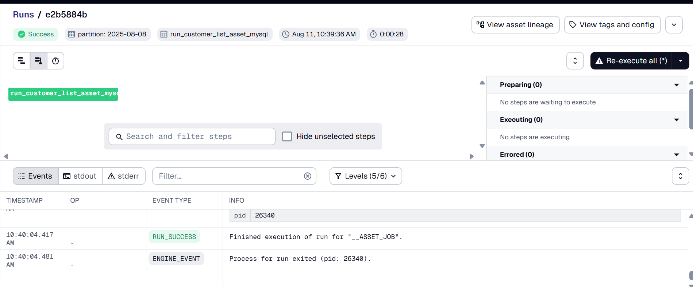
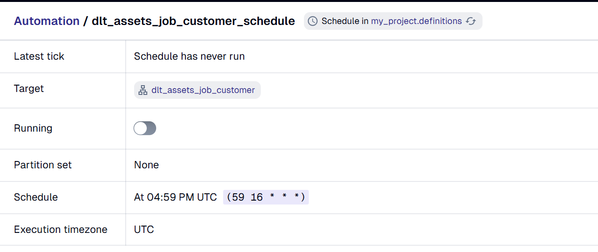
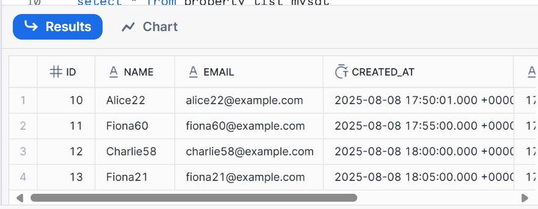
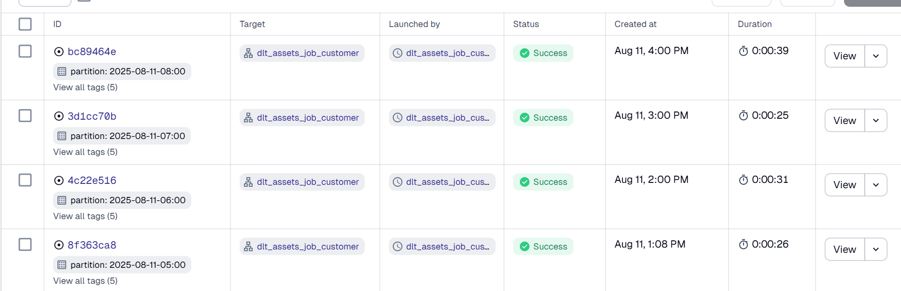
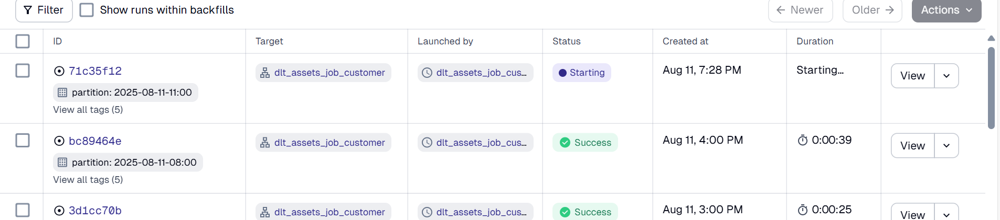

# Version 1 - Local bash scripting dengan cron schedule
tanggal dibuat: 08/08/2025
## membuat file
```bash
touch insert_data.sh
vim insert_data.sh
```

## memberikan permission
chmod 777 insert_data.sh

## list error

```bash
mysql: [Warning] Using a password on the command line interface can be insecure.
./insert_data.sh: line 15: unexpected EOF while looking for matching ``'
cammy@LAPTOP-BTRRPI97:~$ ./insert_data.sh
mysql: [Warning] Using a password on the command line interface can be insecure.
./insert_data.sh: line 16: /home/Cammy/insert_log.txt: No such file or directory
```

1. Error pertama: kebanyakan tanda petik di kodenya
2. Error kedua: ada capslock di pathnya
3. Cron-nya belum jalan. Pas dicek di ```systemctl status cron ``` muncul ```(CRON) info (No MTA installed, discarding output)```

## Mencoba mengatasi masalah cron tidak berjalan
menginstall ```sudo apt-get install postfix```

Masalah yang masih ada:
1. Cron jalan (karena ada di file cron_debug.log yang nyatet tiap kali cronnya jalan), tapi nggak ada data masuk

Cron punya pengetahuan terbatas mengenai perintah di bash, pada kasus ini cron tidak dapat mengenali perintah $RANDOM. Jadi kode dibawah ini

```sh
NAMES=("Alice" "Bob" "Charlie" "Diana" "Evan" "Fiona")
RANDOM_NAME="${NAMES[$RANDOM % ${#NAMES[@]}]}$((RANDOM % 90 + 10))"
EMAIL="${RANDOM_NAME,,}@example.com"  # lowercase email
```

diganti dengan
```sh
NAME=$(shuf -n 1 -e Alice Bob Charlie Diana Evan Fiona)
NUMBER=$(shuf -i 10-99 -n 1)
RANDOM_NAME="${NAME}${NUMBER}"
EMAIL="$(echo "$RANDOM_NAME" | tr '[:upper:]' '[:lower:]')@example.com"
```

insert_log.txt dapat dilihat di [logging](../insert_log.txt)

# Version 2
11/08/2025

## Membuat pipeline untuk loading data mysql ke snowflake
[Langkah membuat pipeline untuk source dan destination tersebut](Database_to_database_replication.md#mysql---snowflake)

untuk memudahkan pembacaan, tabel customers akan dimasukkan ke dalam snowflake dengan schema baru yaitu customer_sql. Cara pembuatan pipeline akan mengikuti arahan yang telah dibuat dalam file markdown diatas (lihat load_standalone_table).

```py
def load_customer_table(filter_date) -> None:
    """Load a few known tables with the standalone sql_table resource, request full schema and deferred
    table reflection"""
    pipeline = dlt.pipeline(
        pipeline_name="customer_data",
        destination='snowflake',
        dataset_name="customer_sql",
    )
    
    def query_adapter_callback(query, table):
        if table.name == "customers":
            return query.where(
            func.DATE(table.c.created_at) == filter_date
            )
        return query

    customers = sql_database(
        query_adapter_callback=query_adapter_callback
    ).with_resources("customers")

    info = pipeline.run(customers, write_disposition="append")
    print(info)
```

## Membuat asset dengan partition dan scheduling

### Partition
Tipe partition yang akan digunakan: Daily partition

```py
daily_partition = dg.DailyPartitionsDefinition(
    start_date=start_date,
    end_date=end_date
)
```
Hasil akhir:


asset tersebut berhasil mengambil data dengan created_date tanggal 08/08/2025

### Schedule
Job akan dijalankan setiap jam 23.59 WIB (16.59 UTC)
```py
asset_partitioned_schedule_customer = dg.build_schedule_from_partitioned_job(
    dlt_assets_job_customer, hour_of_day=16, minute_of_hour=59
)
```

Hasil akhir:


## Cek data
Data berada dalam database Manajemen_kos, schema customer_sql, table customers di dalam snowflake seperti berikut:



# Version 3
11/08/2025

Pada versi ini partition pada asset diubah menjadi hourly untuk melakukan testing apakah alur data sudah berjalan dengan benar

## Pembuatan hourly partition
```py
hourly_partition = dg.HourlyPartitionsDefinition(
    start_date="2025-08-08-00:00+0700",
    end_date="2025-08-15-00:00+0700"
)
```

hourly partition membutuhkan tanggal beserta jam, menit, dan timezone. (sebenernya agak percuma setting timezone, karena pada akhirnya Dagster UI bakal nampilin jamnya yang udah diconvert ke UTC juga)

## Scheduling
Scheduling disini tinggal kita ganti dengan menghapus hour_of_day (karena udah disetting dengan hourly partition juga) dan mengubah minute_of_hour dengan menit keberapa kita ingin schedule dijalankan.

```py
asset_partitioned_schedule_customer = dg.build_schedule_from_partitioned_job(
    dlt_assets_job_customer, minute_of_hour=00 #ambil setiap menit ke-0
)
```

## Perubahan di pipeline
```py
@dg.asset( 
    partitions_def=hourly_partition
)
def run_customer_list_asset_mysql(context: dg.AssetExecutionContext):
    partition_date_str = context.partition_key
    date_to_fetch = partition_date_str
    print("Running DLT pipeline for customers")
    load_customer_table(date_to_fetch)
```

date_to_fetch yang dikembalikan oleh hourly partition bentuknya ```YYYY-MM-DD-HH:MM```, sehingga formatnya perlu diubah dulu supaya dikenali sebagai datetime dalam python
```py
if len(filter_date) == 16:  # formatnya 'YYYY-MM-DD-HH:MM'
        # tambahin :00 detik di akhir
        filter_date = filter_date + ":00"
    start_dt = datetime.strptime(filter_date, "%Y-%m-%d-%H:%M:%S") + timedelta(hours=7) #nyesuaiin timezone
```

Kenapa timezonenya masih perlu disetting?
- Karena di format yang dikembalikan, nggak dikasih tau timezonenya jadi harus setting ulang

Lalu, terjadi perubahan logika di pengambilan query data sesuai partition karena sekarang kita tidak hanya mengambil berdasarkan tanggal saja, namun berdasarkan tanggal dan jam. Sehingga kita memerlukan end datetime untuk mengambil seluruh data dalam jam tersebut.

```py
end_dt = start_dt + timedelta(hours=1)
```

Hasil query akhir:

```py
return query.where(table.c.created_at >= start_dt,
    table.c.created_at < end_dt)
```

## Hasil insert
### Jam 13.08
[data_insert_1pm](../1pm_run.csv)

Penjelasan:
- cron tidak memasukkan semua data di sekitar jam 12.50 - 13.10 karena server berstatus idle saat pc ditinggal untuk jam istirahat
- Job dirunning di jam 13.08 karena pada jam itulah server aktif kembali dan dagster menjalankan job yang seharusnya dijalankan pada jam 13.00 WIB

### Jam 14.00
[data_insert_2pm](../2pm_run.csv)

Penjelasan:
- Data dari jam 13.10 (data jam 13.00 dan 13.05 tidak ada karena server idle) - 13.55 berhasil diambil

### Jam 15.00
[data_insert_3pm](../3pm_run.csv)

Penjelasan:
- Data dari jam 14.00 - 14.55 berhasil diambil

Hasil akhir:


## Test edge case
Apa yang terjadi kalau server idle selama lebih dari 1 jam?
- Dagster akan memulai run yang terlambat pada partisi terakhir saja
