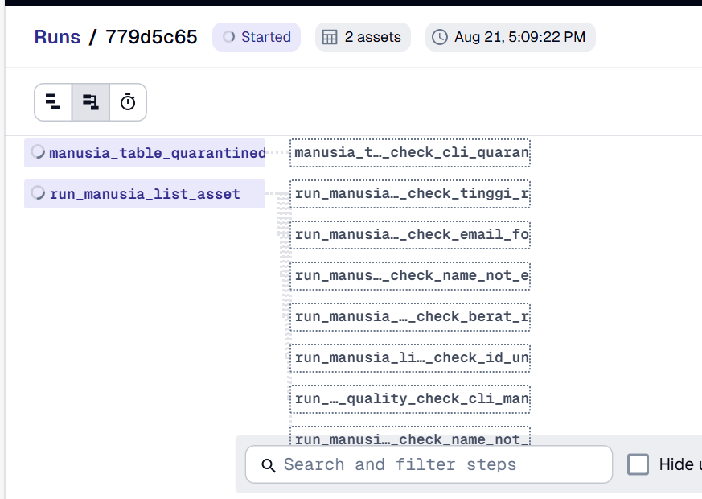
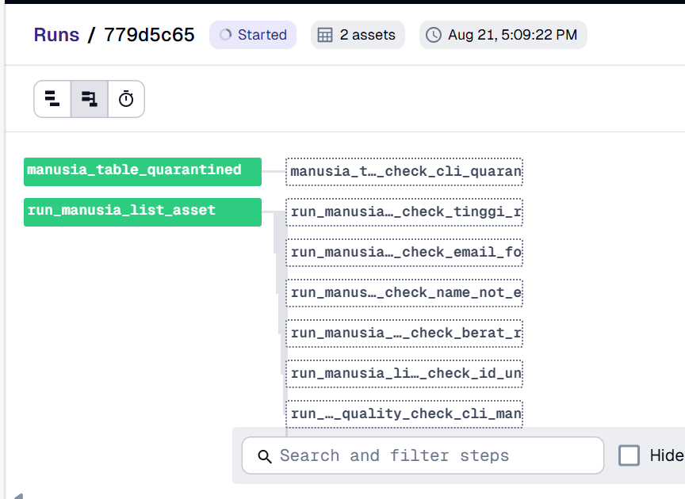
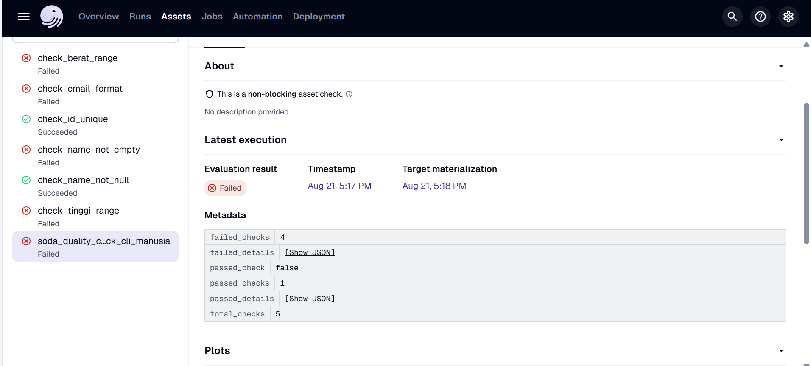
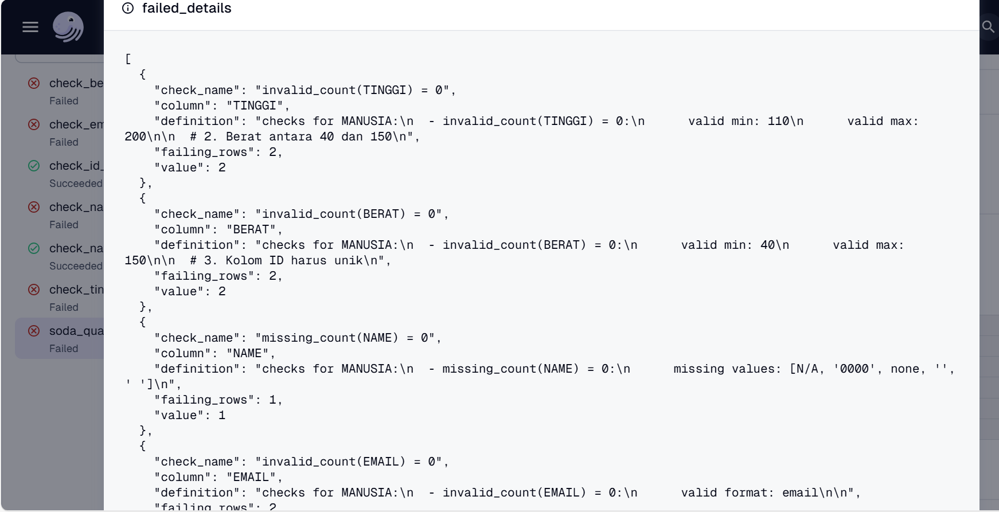
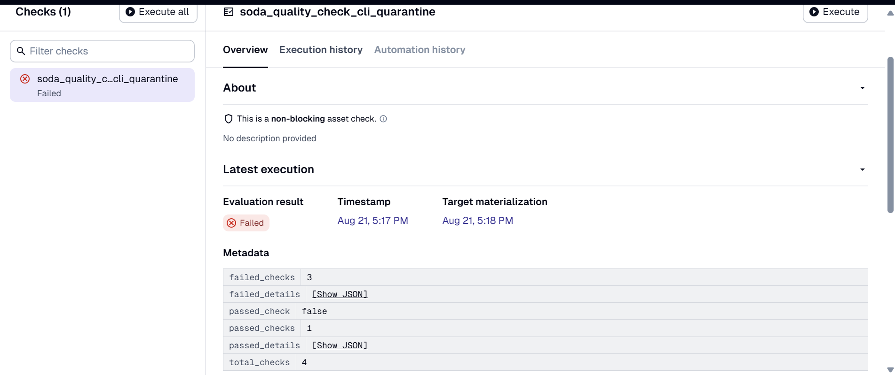
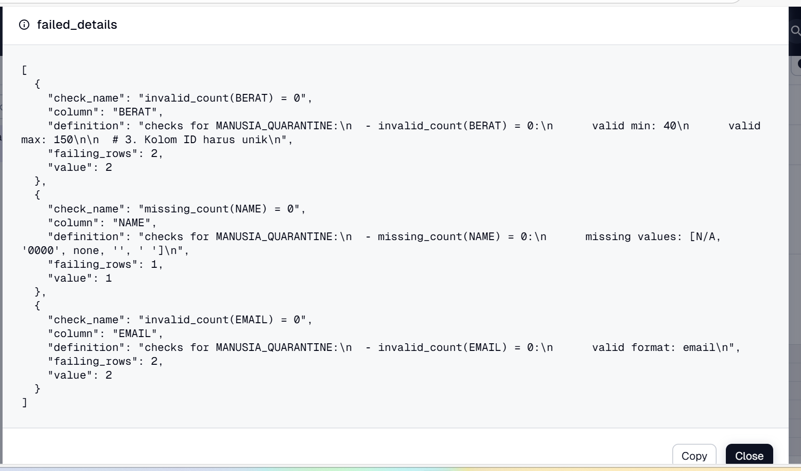

# Prequisite
## Tools
```
dagster
dagster-webserver
sentry_sdk
soda-snowflake
dlt[snowflake]
```
## Setup Sentry
Karena kita juga akan menggunakan Sentry, atur dulu koneksi sentry di file asset_check.py 
```py
import sentry_sdk 
from dotenv import load_dotenv 

load_dotenv()

sentry_sdk.init(
    dsn=os.getenv("SENTRY_DSN"),

    send_default_pii=True,
)
```

## Create dummy data
Pertama-tama, kita akan membuat table yang berisi dummy data bernama 'manusia', tabel tersebut akan memiliki data yang memiliki salah satu ciri-ciri dibawah ini:
1. Data normal (tidak bermasalah)
2. Id duplikat
3. Nama null
4. Email tidak valid
5. Tinggi badan tidak masuk akal
6. Berat badan tidak masuk akal

```sql
CREATE TABLE manusia
(
    id varchar(5),
    name varchar(100),
    email varchar(100),
    tinggi float,
    berat float
);

INSERT INTO manusia (id, name, email, tinggi, berat) VALUES
-- ✅ Data valid
('A002', 'Budi Santoso', 'budi.santoso@example.com', 165, 60),

-- ❌ Nama kosong
('A003', '', 'no.name@example.com', 170, 65),

-- ❌ Email tidak valid
('A004', 'Dedi Kurniawan', 'dedi.kurniawan[at]example.com', 180, 75),
('A005', 'Eka Putri', 'ekaputri.example.com', 160, 55),

-- ❌ Tinggi tidak masuk akal (dalam meter, terlalu kecil)
('A006', 'Fajar Nugraha', 'fajar.nugraha@example.com', 1.7, 65),

-- ❌ Tinggi tidak masuk akal (terlalu besar, misal dalam cm tapi salah input jadi 500)
('A007', 'Gilang Ramadhan', 'gilang.ramadhan@example.com', 500, 70),

-- ❌ Berat tidak masuk akal (dalam gram, terlalu kecil)
('A008', 'Hesti Purnama', 'hesti.purnama@example.com', 160, 0.07),

-- ❌ Berat tidak masuk akal (terlalu besar, misal dalam pound atau salah input jadi 800)
('A009', 'Indra Wijaya', 'indra.wijaya@example.com', 175, 800);
```

## Setup Soda
1. Instalasi package
```bash
uv pip install soda-snowflake
```

2. Setting configuration.yml
```yml
data_source my_datasource_name:
  type: snowflake
  username: <username>
  password: <password>
  account: <account>.<region>
  database: <database>
  warehouse: <warehouse>
  connection_timeout: 240
  role: <role> (disini pakai ACCOUNTADMIN)
  client_session_keep_alive: true
  session_params:
    QUERY_TAG: soda-queries
    QUOTED_IDENTIFIERS_IGNORE_CASE: false
  schema: <schema>
```

untuk mendapatkan account dan region, sebaiknya jalankan query dibawah ini dalam snowflake
```sql
select current_account(), current_region();
```

apabila semuanya sudah disetel, jalankan
```bash
soda test-connection -d my_datasource_name -c configuration.yml -V
```

pastikan terminal menampilkan ```Connection 'my_datasource_name' is valid.```

3. setting checks.yml
Untuk kumpulan command check sendiri bisa dilihat di https://docs.soda.io/sodacl-reference

```yml
# checks.yml
checks for MANUSIA:
  # 1. Tinggi antara 110 dan 200
  - invalid_count(TINGGI) = 0:
      valid min: 110
      valid max: 200

  # 2. Berat antara 40 dan 150
  - invalid_count(BERAT) = 0:
      valid min: 40
      valid max: 150

  # 3. Kolom ID harus unik
  - duplicate_count(ID) = 0

  # 4. Kolom NAME tidak boleh null
  - missing_count(NAME) = 0:
      missing values: [N/A, '0000', none,'',' ']

  # 5. Kolom EMAIL harus format email valid
  - invalid_count(EMAIL) = 0:
      valid format: email

```

Kenapa tidak pakai Soda Cloud seperti yang tersedia pada dokumentasi? https://docs.soda.io/use-case-guides/quick-start-dagster 

Kronologi:
1. url untuk sign up tidak bisa dibuka (error 404 Not Found)
2. Di bagian halaman login tidak ada opsi sign up
3. Setelah ditelusuri di halaman https://www.soda.io/resources/no-bs-guide-to-data-quality-dimensions fitur sign up memang sedang tidak disediakan
```
The self-serve account creation for Soda Cloud is temporarily paused as we're preparing the general availability of several major updates. If you want to try Soda Cloud in the meantime, please schedule a call with our team of experts, discuss your use case, and get started.
```


# Perbandingan
## Dagster Asset Checks
Pro:
- Karena dagster merupakan tools yang kita gunakan, integrasi asset checks ke dalam orchestration lebih mudah
- Dapat menampilkan detail rows yang ditolak


Kontra:
- Data yang telah dimasukkan ke dalam database perlu dipanggil lagi untuk melakukan asset checks. Sehingga cukup boros resource dan waktu.
```py
@asset
def run_manusia_list_asset() -> DataFrame:
    load_manusia_table()
    df = fetch_data_from_snowflake()  #Dibuat fungsi tambahan untuk mengambil kembali data yang sudah dimasukkan ke dalam snowflake. Ditakutkan akan mengganggu skalabilitas apabila volume data sudah besar
    return df
```

### Implementasi
1. Buat asset yang melakukan loading data ke dalam snowflake dan memanggil kembali datanya sebagai dataframe (agar bisa dicek menggunakan asset checks)
```py
@asset
def run_manusia_list_asset() -> DataFrame:
    load_manusia_table()
    df = fetch_data_from_snowflake()
    return df
```

2. Buat asset checks yang mengembalikan jumlah row error dan dictionary json dari data yang error
```py
@asset_check(asset=run_manusia_list_asset, description="Kolom tinggi antara 110 dan 200")
def check_tinggi_range(run_manusia_list_asset: pd.DataFrame) -> AssetCheckResult:
    df = run_manusia_list_asset
    mask = (df["TINGGI"] >= 110) & (df["TINGGI"] <= 200)
    passed = bool(mask.all())
    invalid_df = df[~mask]
    invalid_dicts = invalid_df.to_dict(orient="records")
    invalid_count = int((~mask).sum())
    return AssetCheckResult(
        passed=passed,
        metadata={"invalid_count": invalid_count,
                   "invalid_records": invalid_dicts}
    )
```

Hasil ketika dijalankan:


Isi invalid record


3. Pakai sentry untuk mengirim email setiap ada check yang tidak terpenuhi
```py
@asset_check(asset=run_manusia_list_asset, description="Kolom tinggi antara 110 dan 200")
def check_tinggi_range(run_manusia_list_asset: pd.DataFrame) -> AssetCheckResult:
    df = run_manusia_list_asset
    mask = (df["TINGGI"] >= 110) & (df["TINGGI"] <= 200)
    passed = bool(mask.all())
    invalid_df = df[~mask]
    invalid_dicts = invalid_df.to_dict(orient="records")
    invalid_count = int((~mask).sum())

    status = "warn" if not passed else "ok"

    if status == "warn":
        sentry_sdk.capture_exception( Exception(
            f"[Data Quality Warning] Asset `run_manusia_list_asset` gagal check `tinggi_range`. "
            f"{invalid_count} record invalid."
            f"Invalid records: {invalid_dicts[:5]}..."
         # Hanya tampilkan 5 record pertama
        ))
    return AssetCheckResult(
        passed=passed,
        metadata={
            "invalid_count": invalid_count,
            "invalid_records": invalid_dicts,
            "status": status}
    )
```

## Soda
Pro:
- Check disetting dalam file .yml dengan banyak built-in command yang mempermudah logika pengecekan kualitas data
```yml
# checks.yml
checks for MANUSIA:
  # 1. Tinggi antara 110 dan 200
  - invalid_count(TINGGI) = 0:
      valid min: 110
      valid max: 200

  # 2. Berat antara 40 dan 150
  - invalid_count(BERAT) = 0:
      valid min: 40
      valid max: 150

  # 3. Kolom ID harus unik
  - duplicate_count(ID) = 0

  # 4. Kolom NAME tidak boleh null
  - missing_count(NAME) = 0:
      missing values: [N/A, '0000', none,'',' ']

  # 5. Kolom EMAIL harus format email valid
  - invalid_count(EMAIL) = 0:
      valid format: email

```

Kontra:
- Hanya dapat menampilkan berapa banyak cek yang lolos dan gagal, bukan detailnya. Hasil testing:
```
[10:33:05] Scan summary:
[10:33:05] 1/5 checks PASSED: 
[10:33:05]     MANUSIA in my_datasource_name
[10:33:05]       duplicate_count(ID) = 0 [PASSED]
[10:33:05] 4/5 checks FAILED: 
[10:33:05]     MANUSIA in my_datasource_name
[10:33:05]       invalid_count(TINGGI) = 0 [FAILED]
[10:33:05]         check_value: 2
[10:33:05]       invalid_count(BERAT) = 0 [FAILED]
[10:33:05]         check_value: 2
[10:33:05]       missing_count(NAME) = 0 [FAILED]
[10:33:05]         check_value: 1
[10:33:05]       invalid_count(EMAIL) = 0 [FAILED]
[10:33:05]         check_value: 2
[10:33:05] Oops! 4 failures. 0 warnings. 0 errors. 1 pass.
```
### Implementasi
1. Instalasi package
```bash
uv pip install soda-snowflake
```

2. Setting configuration.yml
```yml
data_source my_datasource_name:
  type: snowflake
  username: <username>
  password: <password>
  account: <account>.<region>
  database: <database>
  warehouse: <warehouse>
  connection_timeout: 240
  role: <role> (disini pakai ACCOUNTADMIN)
  client_session_keep_alive: true
  session_params:
    QUERY_TAG: soda-queries
    QUOTED_IDENTIFIERS_IGNORE_CASE: false
  schema: <schema>
```

untuk mendapatkan account dan region, sebaiknya jalankan query dibawah ini dalam snowflake
```sql
select current_account(), current_region();
```

apabila semuanya sudah disetel, jalankan
```bash
soda test-connection -d my_datasource_name -c configuration.yml -V
```

pastikan terminal menampilkan ```Connection 'my_datasource_name' is valid.```


contoh:
```bash
Successfully connected to 'my_datasource_name'.
[14:58:28] Query 1.my_datasource_name.test-connection:
SELECT 1
Connection 'my_datasource_name' is valid.
```

3. setting checks.yml
Untuk kumpulan command check sendiri bisa dilihat di https://docs.soda.io/sodacl-reference

```yml
# checks.yml
checks for MANUSIA:
  # 1. Tinggi antara 110 dan 200
  - invalid_count(TINGGI) = 0:
      valid min: 110
      valid max: 200

  # 2. Berat antara 40 dan 150
  - invalid_count(BERAT) = 0:
      valid min: 40
      valid max: 150

  # 3. Kolom ID harus unik
  - duplicate_count(ID) = 0

  # 4. Kolom NAME tidak boleh null
  - missing_count(NAME) = 0:
      missing values: [N/A, '0000', none,'',' ']

  # 5. Kolom EMAIL harus format email valid
  - invalid_count(EMAIL) = 0:
      valid format: email

```

jalankan
```bash
soda scan -d my_datasource_name -c configuration.yml checks.yml
```

untuk diintegrasikan dengan dagster asset checks, bisa dijalankan menggunakan sub process seperti ini

```py
@asset_check(asset="run_manusia_list_asset")
def soda_quality_check_cli(context) -> AssetCheckResult:
    result = subprocess.run(
        ["soda", "scan", "-d", "my_datasource_name", "-c", "configuration.yml", "checks.yml"],
        capture_output=True, text=True
    )

    stdout = result.stdout
    stderr = result.stderr

    match = re.search(r"(\d+)/(\d+) checks PASSED", stdout)
    if match:
        passed = int(match.group(1))
        total = int(match.group(2))
    else:
        passed, total = 0, 0

    failed = total - passed

    # Parse failed checks
    failed_details = {}
    pattern = re.compile(
        r"^(?:\[\d{2}:\d{2}:\d{2}\]\s+)?(.*?) \[FAILED\]\s*\n(?:\[\d{2}:\d{2}:\d{2}\]\s+)?check_value:\s*(\d+)",
        re.MULTILINE
    )

    for m in pattern.finditer(stdout):
        expr = m.group(1).strip()
        expr = expr.split(" = ")[0]
        value = m.group(2)
        failed_details[expr] = value

    metadata = {
        "total_checks": total,
        "passed_checks": passed,
        "failed_checks": failed,
        "failed_details": failed_details or {"None": "0"},
        "soda_stdout": stdout[:1000],  # Limit length
        "soda_stderr": stderr[:1000],
    }
    
    passed_check = (failed == 0)

    if not passed_check:
        # Use capture_message instead
        sentry_sdk.capture_message(
            f"[Data Quality Warning] Asset `run_manusia_list_asset` failed soda checks. "
            f"Failed: {failed}/{total} checks. Details: {failed_details}",
            level="error"
        )
        # Add a small delay to ensure Sentry sends the message
        time.sleep(1)

    return AssetCheckResult(
        passed=passed_check,
        metadata=metadata
    )
```

### Implementasi V2 - 1 file yml check untuk masing-masing asset
Alasan: Lebih baik filenya dipisah daripada harus parsing 1 hasil scan yang besar setiap kali asset check dijalankan.


Dataset yang digunakan: Manusia dan Manusia_Quarantine


Dataset tersebut sebenarnya hampir sama, dipakai hanya untuk membuktikan teori implementasi file yml yang berbeda. Untuk pembeda, dataset Manusia memiliki 5 test, sementara Manusia_Quarantine memiliki 4 test saja (tes untuk range tinggi sengaja tidak dimasukkan)


Cara kerja:
1. Buat file yml untuk check yang berbeda


checks_manusia.yml
```yml
# checks.yml
checks for MANUSIA:
  # 1. Tinggi antara 110 dan 200
  - invalid_count(TINGGI) = 0:
      valid min: 110
      valid max: 200

  # 2. Berat antara 40 dan 150
  - invalid_count(BERAT) = 0:
      valid min: 40
      valid max: 150

  # 3. Kolom ID harus unik
  - duplicate_count(ID) = 0

  # 4. Kolom NAME tidak boleh null
  - missing_count(NAME) = 0:
      missing values: [N/A, '0000', none,'',' ']

  # 5. Kolom EMAIL harus format email valid
  - invalid_count(EMAIL) = 0:
      valid format: email
```


checks_manusia_quarantine.yml
```yml
checks for MANUSIA_QUARANTINE:
  # 2. Berat antara 40 dan 150
  - invalid_count(BERAT) = 0:
      valid min: 40
      valid max: 150

  # 3. Kolom ID harus unik
  - duplicate_count(ID) = 0

  # 4. Kolom NAME tidak boleh null
  - missing_count(NAME) = 0:
      missing values: [N/A, '0000', none,'',' ']

  # 5. Kolom EMAIL harus format email valid
  - invalid_count(EMAIL) = 0:
      valid format: email

```
2. Pastikan dagster asset_checks dapat melakukan scan dengan library soda dan menghasilkan file dalam bentuk dictionary
```py
scan = Scan()
scan.set_data_source_name("my_datasource_name")
scan.add_configuration_yaml_file("configuration.yml")
scan.add_sodacl_yaml_file("checks_manusia_quarantine.yml")


# Run scan
result_execute = scan.execute()   # dict-like result
result = scan.get_scan_results()
```

3. Parsing hasil scan untuk mendapatkan metadata yang diinginkan dengan memasukkan ke fungsi
```py
def extract_scan_results(scan_results: dict):
    table_checks = scan_results.get("checks", [])

    if not table_checks:
        return {
            "total_checks": 0,
            "passed_checks": 0,
            "failed_checks": 0,
            "passed_details": [],
            "failed_details": [],
            "passed_check": False  # no checks means it's not passed
        }

    total = len(table_checks)
    passed = sum(1 for c in table_checks if c.get("outcome") == "pass")
    failed = sum(1 for c in table_checks if c.get("outcome") == "fail")

    passed_checks = [
        {
            "check_name": c["name"],
            "column": c.get("column"),
            "definition": c.get("definition")
        }
        for c in table_checks if c.get("outcome") == "pass"
    ]

    failed_checks = [
        {
            "check_name": c["name"],
            "column": c.get("column"),
            "definition": c.get("definition"),
            "value": c.get("diagnostics", {}).get("value"),
            "failing_rows": (
                c.get("diagnostics", {})
                 .get("blocks", [{}])[0]
                 .get("totalFailingRows")
            )
        }
        for c in table_checks if c.get("outcome") == "fail"
    ]

    metadata = {
        "total_checks": total,
        "passed_checks": passed,
        "failed_checks": failed,
        "passed_details": passed_checks,
        "failed_details": failed_checks,
        "passed_check": failed == 0  # convenient flag
    }
    return metadata
```

#### Hasil
- Materialisasi asset





Keterangan: Asset akan dijalankan terlebih dahulu sebelum kumpulan check


- Eksekusi asset check



Keterangan: Check dijalankan untuk masing-masing asset

- Hasil asset_check yang mengandung soda  


Manusia:






Manusia_Quarantine:






Penjelasan: Terdapat perbedaan jumlah test dalam masing-masing asset sesuai dengan yang ditulis pada point pertama

**Setiap 1 source table akan dipisah kedalam 2 table yang berbeda, berarti untuk setiap 1 source table, kita perlu menyiapkan resources sebesar 3 buah table, yang berarti sangat boros.** Sehingga kedepannya pengaplikasian data quality solutions hanya akan melampirkan statistik mengenai data yang gagal

#### Kenapa Capture Exception tidak bisa digunakan untuk soda
Terdapat 2 metode memberikan notifikasi:
1. Capture Exception -> Levelnya otomatis dianggap sebagai error, tapi di asset checks yang sudah terintegrasi dengan soda tidak bisa dijalankan
2. Capture Message -> Levelnya disetting sebagai warn

Ini bukan jawaban yang sudah pasti, ini masih hipotesa saja. Tapi sepertinya karena dagster asset checksnya menjalankan soda di subprocess sementara exception ditangkap di dalam main process, sentry tidak dapat menerima apa-apa.


Jadi sebaiknya apabila ingin menggunakan sentry, pakai saja metode capture message dengan level = error
# Kesimpulan:
1. Volume data kecil dan ingin hasil mendetail -> Dagster Asset Checks
2. Volume data besar dan tidak butuh detail -> Soda

# Cara-cara yang sebelumnya diusulkan dan penyebab kegagalannya
## DLT Schema and Data Contract
Alasan tidak dapat direalisasikan:
1. DLT hanya dapat membandingkan datanya sesuai dengan skema atau tidak pada saat diload saja, bukan sebelum data diload.
2. Apabila data yang tidak memenuhi skema dlt ditolak, dlt tidak dapat memberitahukan mana data yang ditolak. Data langsung dibuang. Jadi harus ngecek manual ke setiap source buat tahu masalah yang terjadi.

## Great Expectation
1. Dalam dokumentasi resmi dagster belum begitu banyak informasi mengenai integrasi great expectation sebagai asset dalam dagster. Hal ini juga dapat dilihat pada issue di github yang telah ditutup karena tidak ada perkembangan. https://github.com/dagster-io/dagster/issues/22562

