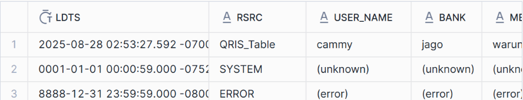
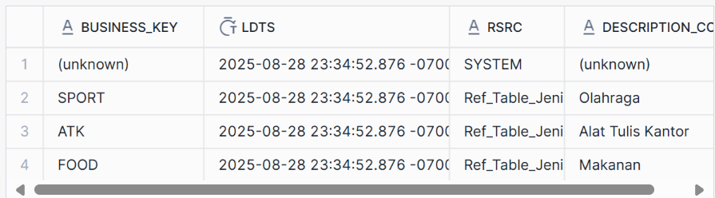
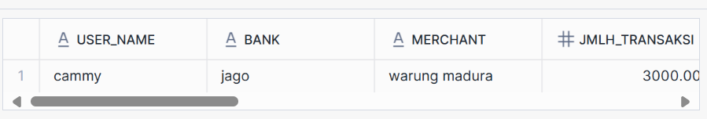

# datavault4dbt
## Melakukan inisiasi project dbt
- Install dbt-core dan dbt-snowflake
- dbt init datavault4dbt_test
- isi credential snowflake 
- ubah directory ke folder tesebut
- lakukan dbt debug untuk memastikan snowflake sudah terhubung secara benar

## Import package datavault4dbt
- buat packages.yml di dalam folder project dan isi dengan
```yml
packages:
  - package: ScalefreeCOM/datavault4dbt
    version: 1.9.11
```
- jalankan dbt deps untuk menginstall packages dependencies

## Membuat table awal di Snowflake
```sql
create database Transaksi;
CREATE OR REPLACE TABLE QRIS_Table (
    user_name STRING,
    bank STRING,
    merchant STRING,
    jmlh_transaksi NUMBER(18,2),
    barang STRING,
    jenis_transaksi STRING,
    tanggal_transaksi TIMESTAMP
);

INSERT INTO QRIS_Table (
    user_name, bank, merchant, jmlh_transaksi, barang, jenis_transaksi, tanggal_transaksi
)
VALUES (
    'cammy',
    'jago',
    'warung madura',
    3000,
    'pena',
    'ATK',
    '2025-08-27 13:05:00'
);
```

## Mendaftarkan tabel awal menjadi staging di dbt
```sql
{{ config(materialized='view') }}


source_model: 
    qris: QRIS_Table
ldts: 'current_timestamp'
rsrc: '!QRIS_Table'
hashed_columns: 
    hk_user_h:
        - user_name
    hk_bank_h:
        - bank
    hk_merchant_h:
        - merchant
    hk_transaksi_qris_l:
        - user_name
        - bank
        - merchant
    hd_qris_s:
        is_hashdiff: true
        columns:
            - jmlh_transaksi
            - barang
            - jenis_transaksi


{{ datavault4dbt.stage(yaml_metadata=yaml_metadata) }}
```


struktur directory:
```
.
├── datavault4dbt_test
│   ├── README.md
│   ├── analyses
│   ├── dbt_packages
│   │   └── datavault4dbt
│   ├── dbt_project.yml
│   ├── logs
│   │   └── dbt.log
│   ├── macros
│   ├── models
│   │   ├── __sources.yml
│   │   ├── schema.yml
│   │   └── stage_qris.sql
│   ├── package-lock.yml
│   ├── packages.yml
│   ├── seeds
│   ├── snapshots
│   ├── target
│   └── tests
├── logs
│   └── dbt.log
└── venv
    ├── bin
```
notes:
- Setelah di materialisasi, isi view akan ketambahan beberapa baris data dari record source SYSTEM dan ERROR seperti ini





- macros tersebut memiliki jenis check not null dan unique terhadap setiap business key. Supaya lebih jelas, berikut visualisasinya
```

-- data di source

user_name   |bank   |merchant       |barang |jmlh_harga |jenis_transaksi
cammy       |jago   |warung madura  |pena   |2000       |ATK
cammy       |BCA    |warung solo    |pensil |3000       |ATK

Hasil: terdapat error pada saat melakukan dbt build karena user_name di table source tidak unique. Data bisa masuk ke staging table meskipun error, tapi karena test yang dilakukan setelahnya tidak terpenuhi maka tahap pembentukan hub tidak dapat dilakukan. Oleh karena itu gunakan dbt run saja.
```


- Di dokumentasi memang hash key untuk link sebenarnya tidak perlu digenerate di staging table, tapi setelah dicoba akan gagal. Oleh karena itu jangan lupa generate juga hash key untuk link di staging.
## Hub
- Membuat file untuk masing-masing hub di folder models
```sql
{{ config(materialized='incremental') }}


hashkey: 'hk_user_h'
business_keys: 
    - user_name
source_models: stage_qris


{{ datavault4dbt.hub(yaml_metadata=yaml_metadata) }}
```


- jalankan ```dbt run```

## Link
- Membuat file untuk Link di folder models
```sql
{{ config(materialized='incremental') }}


link_hashkey: 'hk_transaksi_qris_l'
foreign_hashkeys:
    - 'hk_user_h'
    - 'hk_bank_h'
    - 'hk_merchant_h'
source_models: stage_qris
    

{{ datavault4dbt.link(yaml_metadata=yaml_metadata) }}
```

- jalankan dbt run

## Satellite
- V0
```sql
{{ config(materialized='incremental') }}


parent_hashkey: 'hk_transaksi_qris_l'
src_hashdiff: 'hd_qris_s'
src_payload:
    - jmlh_transaksi
    - barang
    - jenis_transaksi
    - tanggal_transaksi
source_model: 'stage_qris'
    

{{ datavault4dbt.sat_v0(yaml_metadata=yaml_metadata) }}
```

- V1
```sql
{{ config(materialized='view') }}


sat_v0: 'SAT_Transaksi_Qris'
hashkey: 'hk_transaksi_qris_l'
hashdiff: 'hd_qris_s'   
ledts_alias: 'loadenddate'
add_is_current_flag: true
    

{{ datavault4dbt.sat_v1(yaml_metadata=yaml_metadata) }}
```


Perbedaan:
- di v1 ada kolom load date, record source, is valid

## Reference Table
### Staging
```sql
{{ config(materialized='view') }}


source_model: 
    reference: Ref_Table_Jenis_Transaksi
ldts: 'current_timestamp'
rsrc: '!Ref_Table_Jenis_Transaksi'
hashed_columns: 
    hk_jenis_transaksi_h:
        - BUSINESS_KEY



{{ datavault4dbt.stage(yaml_metadata=yaml_metadata) }}

```
### Hub Reference
```sql
{{ config(materialized='incremental') }}


source_models: stage_reference
ref_keys: BUSINESS_KEY
      

{{ datavault4dbt.ref_hub(yaml_metadata=yaml_metadata) }}
```

### Satellite Reference
- v0
```sql
{{ config(materialized='incremental') }}


source_model: stage_reference
parent_ref_keys: BUSINESS_KEY
src_hashdiff: hk_jenis_transaksi_h
src_payload:
    - description_col
      

{{ datavault4dbt.ref_sat_v0(yaml_metadata=yaml_metadata) }}
```

- v1
```sql
{{ config(materialized='view') }}


ref_sat_v0: SAT_Reference
ref_keys: BUSINESS_KEY
hashdiff: hk_jenis_transaksi_h
add_is_current_flag: true
      

{{ datavault4dbt.ref_sat_v1(yaml_metadata=yaml_metadata) }}
```
Dibuat karena di reference table akhir butuh load_date dari satellite v1


Notes:
- parent_ref_keys case sensitive. Karena di snowflake table ditulis menggunakan capslock maka harus ditulis seperti itu juga

### Table
```sql
{{ config(schema='core', materialized='view') }}


ref_hub: 'HUB_Reference'
ref_satellites: 
    SAT_Reference_v1:
        include:
            - description_col
historized: 'latest'


{{ datavault4dbt.ref_table(yaml_metadata=yaml_metadata) }}
```

Hasil akhir



## Fact
- Buat CTE untuk filter transaksi yang valid di folder models
```sql
{{ config(materialized='view') }}

select 
    HK_TRANSAKSI_QRIS_L, 
    JMLH_TRANSAKSI, 
    TANGGAL_TRANSAKSI
from (
    select 
        HK_TRANSAKSI_QRIS_L, 
        JMLH_TRANSAKSI, 
        TANGGAL_TRANSAKSI, 
        row_number() over (
            partition by TANGGAL_TRANSAKSI, HK_TRANSAKSI_QRIS_L 
            order by LDTS desc
        ) as rn
    from {{ ref('SAT_Transaksi_Qris_v1') }}
) vt
where rn = 1
```

Kemungkinan bisa pakai kolom is valid yang tersedia dari satellite v1 daripada harus menggunakan row_number


- Buat CTE untuk join dengan Hub Bank di folder models
```sql
{{ config(materialized='view') }}

select 
    bb.BANK, 
    vt.JMLH_TRANSAKSI, 
    vt.TANGGAL_TRANSAKSI
from {{ ref('valid_transaction') }} vt
join {{ ref('LINK_Transaksi_Qris') }} lq
    on vt.HK_TRANSAKSI_QRIS_L = lq.HK_TRANSAKSI_QRIS_L
join {{ ref('HUB_Bank') }} bb
    on lq.hk_bank_h = bb.hk_bank_h
```

- Buat CTE untuk agregasi jumlah transaksi di folder models
```sql
{{ config(materialized='table') }}

select 
    BANK, 
    month(TANGGAL_TRANSAKSI) as bulan, 
    sum(JMLH_TRANSAKSI) as total_transaksi, 
    count(JMLH_TRANSAKSI) as frekuensi_transaksi
from {{ ref('bank_transaction') }}
group by BANK, month(TANGGAL_TRANSAKSI)
```

## Dim
```sql
{{ config(materialized='table') }}

select 
    BANK
from {{ ref('HUB_Bank') }}
```

# automatedv
## Melakukan inisiasi project dbt
- dbt init automatedv
- isi credential snowflake 
- ubah directory ke folder tesebut
- lakukan dbt debug untuk memastikan snowflake sudah terhubung secara benar

## Import package automatedv
- buat packages.yml di dalam folder project dan isi dengan
```yml
packages:
  - package: Datavault-UK/automate_dv
    version: 0.11.2
```
- jalankan dbt deps untuk menginstall packages dependencies

## Membuat table awal di Snowflake
```sql
create database Transaksi;
CREATE OR REPLACE TABLE QRIS_Table (
    user_name STRING,
    bank STRING,
    merchant STRING,
    jmlh_transaksi NUMBER(18,2),
    barang STRING,
    jenis_transaksi STRING,
    tanggal_transaksi TIMESTAMP
);

INSERT INTO QRIS_Table (
    user_name, bank, merchant, jmlh_transaksi, barang, jenis_transaksi, tanggal_transaksi
)
VALUES (
    'cammy',
    'jago',
    'warung madura',
    3000,
    'pena',
    'ATK',
    '2025-08-27 13:05:00'
);
```

## Mendaftarkan tabel awal menjadi staging di dbt
```sql
{{ config(materialized='view') }}


source_model: 
  qris: QRIS_Table
derived_columns:
  SOURCE: "!QRIS_Table"
  LOAD_DATETIME: "current_timestamp"
hashed_columns:
  HK_USER_H: "USER_NAME"
  HK_BANK_H: "BANK"
  HK_MERCHANT_H: "MERCHANT"
  HK_TRANSAKSI_QRIS_L:
    - "USER_NAME"
    - "BANK"
    - "MERCHANT"
  HD_QRIS_S:
    is_hashdiff: true
    columns:
      - "JMLH_TRANSAKSI"
      - "BARANG"
      - "JENIS_TRANSAKSI"




{{ automate_dv.stage(include_source_columns=true,
                     source_model=metadata_dict['source_model'],
                     derived_columns=metadata_dict['derived_columns'],
                     null_columns=none,
                     hashed_columns=metadata_dict['hashed_columns'],
                     ranked_columns=none) }}
```

hasil:


## Hub
```sql
{{ config(materialized='incremental')    }}







{{ automate_dv.hub(src_pk=src_pk, src_nk=src_nk, src_ldts=src_ldts,
                   src_source=src_source, source_model=source_model) }}
```

## Link
```sql
{{ config(materialized='incremental')         }}







{{ automate_dv.link(src_pk=src_pk, src_fk=src_fk, src_ldts=src_ldts,
                    src_source=src_source, source_model=source_model) }}
```

## Satellite
```sql
{{ config(materialized='incremental') }}


source_model: "stage_qris"
src_pk: "HK_TRANSAKSI_QRIS_L"
src_hashdiff: 
  source_column: "HD_QRIS_S"
  alias: "HASHDIFF"
src_payload:
  - "JMLH_TRANSAKSI"
  - "BARANG"
  - "JENIS_TRANSAKSI"
  - "TANGGAL_TRANSAKSI"
src_eff: "EFFECTIVE_FROM"
src_ldts: "LOAD_DATETIME"
src_source: "SOURCE"




{{ automate_dv.sat(src_pk=metadata_dict["src_pk"],
                   src_hashdiff=metadata_dict["src_hashdiff"],
                   src_payload=metadata_dict["src_payload"],
                   src_eff=metadata_dict["src_eff"],
                   src_ldts=metadata_dict["src_ldts"],
                   src_source=metadata_dict["src_source"],
                   source_model=metadata_dict["source_model"])   }}
```

## Reference Table
### Staging
```sql
{{ config(materialized='view') }}


source_model: 
  reference: Ref_Table_Jenis_Transaksi
derived_columns:
  SOURCE: "!Ref_Table_Jenis_Transaksi"
  LOAD_DATETIME: "current_timestamp"
  EFFECTIVE_FROM: "current_timestamp"
  START_DATE: "current_timestamp"
  END_DATE: "TO_DATE('9999-12-31')"
hashed_columns:
  HK_JENIS_TRANSAKSI_R: "BUSINESS_KEY"
  HD_DESCRIPTION_R:
    is_hashdiff: true
    columns:
      - "BUSINESS_KEY"
      - "DESCRIPTION_COL"




{{ automate_dv.stage(include_source_columns=true,
                     source_model=metadata_dict['source_model'],
                     derived_columns=metadata_dict['derived_columns'],
                     null_columns=none,
                     hashed_columns=metadata_dict['hashed_columns'],
                     ranked_columns=none) }}

```

### Table
```sql
{{ config(materialized='incremental') }}




{{ automate_dv.ref_table(src_pk=src_pk, 
                         src_extra_columns=none,
                         source_model=source_model) }}
```

### Satellite
```sql
{{ config(materialized='incremental') }}


source_model: "stage_reference"
src_pk: "HK_JENIS_TRANSAKSI_R"
src_hashdiff: 
  source_column: "HD_DESCRIPTION_R"
  alias: "HASHDIFF"
src_payload:
  - "DESCRIPTION_COL"
src_eff: "EFFECTIVE_FROM"
src_ldts: "LOAD_DATETIME"
src_source: "SOURCE"




{{ automate_dv.sat(src_pk=metadata_dict["src_pk"],
                   src_hashdiff=metadata_dict["src_hashdiff"],
                   src_payload=metadata_dict["src_payload"],
                   src_eff=metadata_dict["src_eff"],
                   src_ldts=metadata_dict["src_ldts"],
                   src_source=metadata_dict["src_source"],
                   source_model=metadata_dict["source_model"])   }}
```

## Dim dan Fact
Sama seperti untuk datavault4dbt

# Kesimpulan akhir
Perbedaan antara datavault4dbt dan automatedv:
- Bentuk data pada kolom
    1. datavault4dbt - akan digenerate dummy data pada saat load ke staging (row yang berisi data yang berasal dari SYSTEM dan ERROR)
    2. automatedv - sudah clean
- Satellite
    1.  datavault4dbt - membutuhkan 2 model yang berbeda (v0 dan v1) yang harus dibuat apabila mau satellite dengan load date, record source, is valid. 
    2. automatedv - menyediakan satellite yang langsung memiliki info load date, namun tidak ada kolom is valid
- Pendekatan terhadap pembuatan reference table:
    1. datavault4dbt - staging->hub reference->satellite reference-> reference table yang menggabungkan hub dan satellite
    2. automatedv - staging->reference table->satellite reference

## Pendapat
automatedv lebih nyaman digunakan karena tidak perlu banyak model yang perlu dibuat, sehingga lebih hemat resources