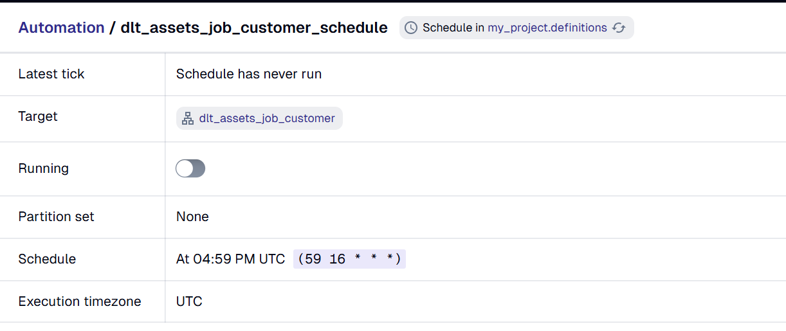
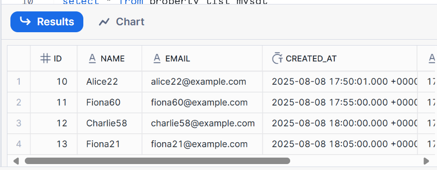

# Version 1
08/08/2025
## bikin file
touch insert_data.sh
vim insert_data.sh

## kasih permission
chmod 777 insert_data.sh

## list error

```bash
mysql: [Warning] Using a password on the command line interface can be insecure.
./insert_data.sh: line 15: unexpected EOF while looking for matching ``'
cammy@LAPTOP-BTRRPI97:~$ ./insert_data.sh
mysql: [Warning] Using a password on the command line interface can be insecure.
./insert_data.sh: line 16: /home/Cammy/insert_log.txt: No such file or directory
```

1. Error pertama: kebanyakan tanda petik di kodenya
2. Error kedua: ada capslock di pathnya
3. Cron-nya belum jalan. Pas dicek di ```systemctl status cron ``` muncul ```(CRON) info (No MTA installed, discarding output)```

## Mencoba mengatasi masalah cron tidak berjalan
menginstall ```sudo apt-get install postfix```

Masalah yang masih ada:
1. Cron jalan (karena ada di file cron_debug.log yang nyatet tiap kali cronnya jalan), tapi nggak ada data masuk

Cron punya pengetahuan terbatas mengenai perintah di bash, pada kasus ini cron tidak dapat mengenali perintah $RANDOM. Jadi kode dibawah ini

```sh
NAMES=("Alice" "Bob" "Charlie" "Diana" "Evan" "Fiona")
RANDOM_NAME="${NAMES[$RANDOM % ${#NAMES[@]}]}$((RANDOM % 90 + 10))"
EMAIL="${RANDOM_NAME,,}@example.com"  # lowercase email
```

diganti dengan
```sh
NAME=$(shuf -n 1 -e Alice Bob Charlie Diana Evan Fiona)
NUMBER=$(shuf -i 10-99 -n 1)
RANDOM_NAME="${NAME}${NUMBER}"
EMAIL="$(echo "$RANDOM_NAME" | tr '[:upper:]' '[:lower:]')@example.com"
```

insert_log.txt dapat dilihat di [logging](insert_log.txt)

# Version 2
11/08/2025

## Membuat pipeline untuk loading data mysql ke snowflake
[Langkah membuat pipeline untuk source dan destination tersebut](Database_to_database_replication.md#mysql---snowflake)

untuk memudahkan pembacaan, tabel customers akan dimasukkan ke dalam snowflake dengan schema baru yaitu customer_sql. Cara pembuatan pipeline akan mengikuti arahan yang telah dibuat dalam file markdown diatas (lihat load_standalone_table).

```py
def load_customer_table(filter_date) -> None:
    """Load a few known tables with the standalone sql_table resource, request full schema and deferred
    table reflection"""
    pipeline = dlt.pipeline(
        pipeline_name="customer_data",
        destination='snowflake',
        dataset_name="customer_sql",
    )
    
    def query_adapter_callback(query, table):
        if table.name == "customers":
            return query.where(
            func.DATE(table.c.created_at) == filter_date
            )
        return query

    customers = sql_database(
        query_adapter_callback=query_adapter_callback
    ).with_resources("customers")

    info = pipeline.run(customers, write_disposition="append")
    print(info)
```

## Membuat asset dengan partition dan scheduling

### Partition
Tipe partition yang akan digunakan: Daily partition

```py
daily_partition = dg.DailyPartitionsDefinition(
    start_date=start_date,
    end_date=end_date
)
```
Hasil akhir:


asset tersebut berhasil mengambil data dengan created_date tanggal 08/08/2025

### Schedule
Job akan dijalankan setiap jam 23.59 WIB (16.59 UTC)
```py
asset_partitioned_schedule_customer = dg.build_schedule_from_partitioned_job(
    dlt_assets_job_customer, hour_of_day=16, minute_of_hour=59
)
```

Hasil akhir:


## Cek data
Data berada dalam database Manajemen_kos, schema customer_sql, table customers di dalam snowflake seperti berikut:

