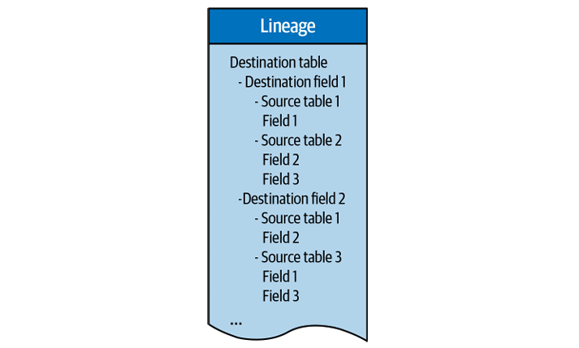

# Bab 1
## Downtime
Penyebab:
1. Migrasi ke cloud
2. Source data yang semakin banyak
3. Pipeline yang semakin kompleks
4. Tim data yang semakin terspesialisasi (makin banyak bagian -> makin sering terjadi miskomunikasi)
5. Tim data yang ter-desentralisasi (data yang makin sering digunakan berbagai macam tim lebih rawan "rusak")

# Bab 2
## Operational vs Analytical data
- Operational data: Data yang didapatkan berdasarkan apa yang terjadi dalam lingkup bisnis (kondisi barang di gudang, dll)
- Analytical data: Data yang didapatkan untuk keperluan keputusan bisnis (customer churn, dll)

## Data lake vs data warehouse
- Data lake: Menyimpan semua data dengan struktur yang berbeda, schemanya terbuat on read
- Data warehouse: Menyimpan semua data dengan struktur format yang sama, schemanya terbuat on write

### Data lakehouse
Menggabungkan data warehouse dan data lake untuk menciptakan tempat penyimpanan yang fleksibel dan murah (dari data lake), namun juga rapi dan cepat (dari data warehouse)

## Data quality metrics
1. Apakah datanya sudah merupakan data terbaru?
2. Apakah datanya lengkap?
3. Apakah field data sudah sesuai dalam rentang yang ditetapkan?
4. Apakah proporsi null values lebih tinggi atau lebih rendah dari yang seharusnya?
5. Apakah schemanya sudah berubah?

### Cara mengeceknya dari snowflake
1. Map your inventory -> ambil list table dan metadata
2. Monitor data freshness and volume
3. Build your query history
4. Health check

## Data Catalog
Membuat suatu variabel yang menyimpan informasi koleksi data yang kita miliki, tujuan data, siapa saja yang bisa mengakses, dll.

# Bab 3
## Collecting data
### Jenis source collection dan apa yang perlu diperhatikan
#### Application log data
- Structure
- Timestamp
- Log level (INFO, WARN, atau ERROR)
- Purpose (Diagnostic: WARN dan ERROR, Audit: INFO)

#### API Responses
- Structure
- Response code (200,404,dll)
- Purpose

#### Sensor Data
- Noise
- Failure mode
- Purpose

### Batch vs stream
- Batch: data dikumpulkan terlebih dahulu sebelum diload
- Stream: data diload secara real time

Permasalahan data quality rentan terjadi dalam stream karena testing tidak dapat dilakukan secara optimal.

## Cleaning data
- Outlier removal
- Assessing data set features (pilih mana yang dibutuhkan mana yang nggak)
- Normalization
- Data reconstruction (recover missing value, interpolation, extrapolation, categorizing/labeling)
- Timezone conversion
- Type coercions

## Normalizing data
- Handling heterogenous data sources
- Schema checking and type coercion
- Syntactic VS Semantic ambiguity in data 
    syntactic = cara penulisan yang ambigu
    
    semantic = makna data yang ambigu (profit di berbagai sumber bisa beda arti)

## Running critical data transformation
Ensuring data quality during transformation:
1. Renaming fields
2. Filter, generate, summarize, deduplicate
3. Type and unit conversion
4. Data governance audit/data quality checks

## Alerting and testing
- Null values
- Volume -> did I get any data? Too much or too little?
- Distribution -> accepted range
- Uniqueness
- Known invariant -> are those 2 objects fundamentally different from each other?

### Tools
- DBT Unit testing
- Great Expectation unit testing
- Deequ unit testing

# Bab 4
## Types of data quality issues
1. Those you can predict
    Ketahuan dari testing yang dilakukan

2. Those you can't predict
    Nggak ketahuan dari tes karena memang tidak ada yang mengira akan terjadi

## Anomaly detection algorithm
- Monitoring for freshness
    Lihat terakhir kali data masuk kapan dan seharusnya sudah masuk data yang kapan? Hal ini bisa digunakan untuk mendeteksi apakah pipeline bermasalah pada jam tertentu
- Understanding distribution
    Lihat persebaran data, lihat juga apakah value null masih terbilang wajar atau tidak

## Building monitors for schema and lineage
- Visualizing lineage
    1. Downstream yang terkena impact
    2. Upstream yang menjadi akar suatu objek

## Scaling anomaly detection with python and machine learning
Jenis hasil detection
- False positive: dibilang ada anomaly padahal nggak
- False negative: dibilang nggak ada anomaly padahal ada
- True positive: dibilang ada anomaly dan beneran ada
- True negative: dibilang nggak ada anomaly dan beneran nggak ada

### Rumus ketepatan
- Precision: TP/(TP+FP) (dari semua alert, berapa yang bener)
- Recall: TP/(TP+FN) (dari semua error, berapa yang terdeteksi)
- F Scores: 2/((1/recall)+(1/precision)) (Ketepatan keseluruhan)

# Bab 5
Data reliability: kemampuan organisasi dalam mengantarkan data berkualitas dalam setiap tahapan data life cycle

## Measuring and maintaining data quality in the pipeline
Data observability pillars:
- Freshness
- Distribution
- Volume
- Schema
- Lineage

## Understanding data quality downstream
Cara menghadapi permasalahan quality dan reliability data di tahap analytic:
1. Dashboard yang menampilkan time to detection (TTD), time to resolution (TTR), dan quality metrics lainnya
2. Service-level agreement(SLA) -> Membuat janji dan konsekuensi apabila service tidak ditepati
3. Service-level indicator(SLI) -> Variabel yang terukur mengenai service
4. Service-level objective(SLO) -> Target SLI
5. Net promoter score -> mengetahui seberapa puas stakeholder

6 Variabel pengukur data quality:
- completeness
- timeliness
- validity
- accuracy
- consistency
- uniqueness

## Building your data platform
### Data ingestion
Proses mengambil data dari sumbernya

### Data storage and processing
Tempat dimana data yang diambil disimpan

### Data transformation and modelling
- Data transformation: mengubah data mentah ke bentuk yang siap digunakan.
- Data modeling: melakukan identifikasi key concepts dan hubungan dalam data untuk logika bisnis

Biasa dilakukan dengan scripting language seperti Python, R, SQL.

### Business intelligence and analytics
Membangun bagian analisis: dashboard, data story telling, graph.

### Data discovery and governance
Mengatur siapa yang boleh akses data, memastikan data sesuai regulasi dan memudahkan orang menemukan dataset yang relevan.

## Developing trust in your data
### Data observability
Seberapa besar kemampuan organisasi dalam mengetahui health status data pada setiap tahapan data lifecycle.

### Measuring Return of Investment on data quality
(Time to detection + time to repair) x Downtime hourly cost = Cost of data downtime
Labor cost + Compliance risk + Opportunity cost = Annual cost of broken data

## How to Set SLAs, SLOs, and SLIs for Your Data
### SLA
Cari tahu data yang reliable itu karakteristiknya seperti apa sesuai kebutuhan user

### SLI
- Jumlah insiden yang terjadi dalam 1 dataset
- Frekuensi tabel yang penting diupdate
- Distribusi data yang diharapkan

### SLO
Setelah mengetahui SLI, tentukan target yang masuk akal

# Bab 6
## Data incident management
### Detect
- Mendeteksi anomali yang terjadi, bisa dilihat di bagian [anomaly_detection](#anomaly-detection-algorithm)
- Melihat apakah ada yang janggal di health detection

### Resolve
- Melihat metadata dan memberitahukan kepada tim yang terkena dampak dari insiden yang terjadi
- Root cause analysis
    1. Lihat ke bagian lineage. Untuk mengetahui apakah insiden terjadi dari nodes upstream
    2. Lihat ke bagian code. Untuk memastikan apakah insiden terjadi dari kesalahan logika
    3. Lihat ke bagian data itu sendiri. Untuk melihat apakah fields lain dalam tabel merupakan penyebab terjadinya anomali, apakah terjadi di setiap rows?
    4. Lihat ke bagian operational environment. Log dalam pipeline dapat memberikan hint mengenai alasan terjadi insiden
    5. Tanya/minta pendapat ke co-worker

### Prevent
- Frame everything as a learning experience.
- Use this as an opportunity to assess your readiness for future incidents.
- Document each postmortem and share with the broader data team.
- Revisit service-level agreements (SLAs).

# Bab 7
## Basic lineage requirements
- Fast time to value
- Secure architecture
- Automation
- Integration with popular data tools
- Extraction of column-level information

## Data lineage design
- The destination table, stored in the downstream report
- The destination fields, stored in the destination table
- The source tables, stored in the data warehouse

# Bab 8
## Treating data like product
Data as a Product (DaaP) merupakan konsep di mana kita memperlakukan dataset atau data pipeline bukan cuma sebagai “hasil sampingan” dari sistem, tapi benar-benar sebagai produk yang punya owner, standar kualitas, dan user yang jelas.

Karakteristik apa saja yang perlu dicapai:
- Meningkatkan aksesibilitas (data ada ketika diperlukan)
- Meningkatkan demokrasi (orang yang berkepentingan dapat memanipulasi data)
- ROI yang lebih cepat karena insight lebih cepat didapatkan
- Menghemat waktu untuk tim data dan konsumer
- Insight yang lebih tepat

## Kapan harus beli vs kapan harus buat sendiri
Buat sendiri ketika:
- Productnya harus pake data yang sifatnya classified/rahasia
- Kustomisasi yang banyak

## Data certification program
Sertifikasi resmi untuk dataset atau data product, yang tujuannya memastikan bahwa data tersebut sudah memenuhi standar kualitas dan kelayakan tertentu sebelum digunakan secara luas.

1. Tingkatkan kapabilitas data observability
2. Tunjuk siapa data owner
3. Memahami karakteristik data yang "baik"
4. Buat SLA, SLI, dan SLO
5. Kembangkan strategi incident management
6. Tampilkan di product data yang kita buat kalau datanya sudah tersertifikasi
7. Latih tim data dan consumer mengenai prosedur yang benar

# Bab 9
## Data mesh
data mesh mengusulkan supaya data dikelola secara desentralisasi oleh tim-tim yang punya domain bisnis masing-masing. Jadi setiap tim bertanggung jawab atas data mereka sendiri, dari produksi sampai konsumsi.

