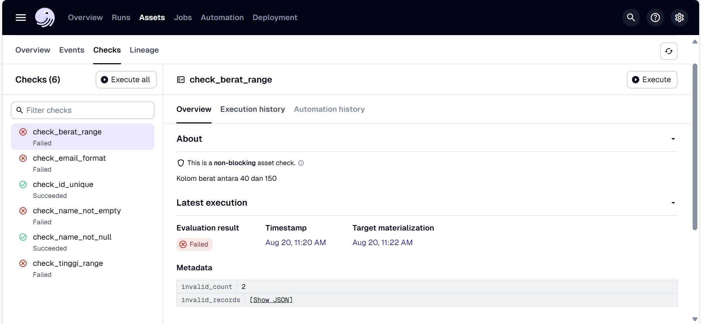

# Ide
## Tahap Extract dan Load (Tidak dapat direalisasikan)
Alasan tidak dapat direalisasikan:
1. DLT hanya dapat membandingkan datanya sesuai dengan skema atau tidak pada saat diload saja, bukan sebelum data diload.
2. Apabila data yang tidak memenuhi skema dlt ditolak, dlt tidak dapat memberitahukan mana data yang ditolak. Data langsung dibuang. Jadi harus ngecek manual ke setiap source buat tahu masalah yang terjadi.


#### Schema dan Data Contract
Tools: DLT, Sentry, Dagster

Schema dapat dibuat dalam fungsi Python maupun file .yaml terpisah, digunakan sebagai acuan validasi struktur dan tipe data yang dimuat oleh pipeline. Sementara itu, data contract adalah aturan yang ditetapkan untuk mengatasi apabila terjadi sebuah perubahan schema.

Terdapat 3 level dalam data contract:
1. Table:
    - evolve: Allows the creation of new tables within the schema.
    - freeze: Prevents any changes to the schema, ensuring no new tables can be added.
2. Column:
    - evolve: Allows for the addition of new columns or changes in the existing ones.
    - freeze: Prevents any changes to the existing columns.
    - discard_row: Skips rows that have new columns but loads those that follow the existing schema.
    - discard_value: Doesn't skip entire rows. Instead, it only skips the values of new columns loading the rest of the row data.
3. Data type:
    - evolve: Allows any data type. This may result with variant columns upstream.
    - freeze: Prevents any changes to the existing data types.
    - discard_row: Omits rows with unverifiable data types.
    - discard_value: Replaces unverifiable values with None, but retains the rest of the row data.

apabila terdapat pelanggaran terhadap schema, akan ditampilkan dalam SchemaValidationError yang bisa diimport dari library dlt.common.schema.exceptions

#### Sentry
Berdasarkan tutorial Advanced DLT bagian 8: Logging & Tracing(https://colab.research.google.com/drive/1YCjHWMyOO9QGC66t1a5bIxL-ZUeVKViR#forceEdit=true&sandboxMode=true), DLT dapat terhubung dengan Sentry.

Sentry merupakan sebuah tools yang menangani error logging & tracking. Sentry akan menampilkan hasil exception dalam python ke dalam dashboardnya melalui fungsi ```sentry_sdk.capture_exception(e)```

### Alur kerja
1. Tetapkan schema untuk masing-masing data
2. Setting data contract untuk setiap level sebagai freeze, agar schema tidak berubah. Write disposition = merge
3. Buat sentry menangkap exception yang menyebabkan pipeline gagal dijalankan
4. Buat sentry mengirim alert melalui e-mail/teams/slack

Alternatif yang lebih susah tapi kayaknya lebih efektif
1. Tetapkan schema untuk masing-masing data
2. Setting data contract column sebagai discard_row, agar data yang bener tetep bisa masuk supaya nggak ganggu proses bisnis. Write disposition = merge
3. Pastiin sentry bisa deteksi mana aja data yang rusak buat dia jadiin alert (pake sentry_sdk.capture_message tapi log levelnya setting jadi ERROR karena defaultnya INFO)
4. Masukin data yang rusak ke dalam tabel khusus buat diolah dulu
5. Setelah data yang bermasalah diperbaiki, load lagi ke pipeline

## Tahap transform
Tools: DBT, Dagster, Great Expectation

#### DBT Unit testing
DBT dapat melakukan generic dan singular testing, tapi tidak dapat membuat alert untuk developer.

#### Great Expectation
Merupakan library python yang digunakan untuk melakukan testing terhadap data. Tools ini juga dapat mengirimkan alert lewat e-mail/slack/teams

### Alur kerja
1. Cek lagi di Great Expectation dan dbt dijadikan alat transform aja
2. Transformasi di dbt
3. Lanjut ke nodes selanjutnya
4. Ulangi step 1-3 sampai data sampai ke user

Kenapa nggak ngirim alert dari dagster aja?
- Dagster cuma bakal ngasih alert "job A is failed" tapi buat detailnya kita tetep harus nyari sendiri di log

## Extra step
### Dashboard
Kalau berdasarkan buku Data Quality Fundamental, sebaiknya buat 2 buah dashboard ini

1. Monitoring for freshness
    Buat graph bar chart yang terbentuk dari jumlah data yang masuk per-harinya
```sql
     SELECT
        DATE_ADDED,
        COUNT(*) AS ROWS_ADDED
    FROM
        EXOPLANETS
    GROUP BY
        DATE_ADDED;
```

2. Understanding distribution
    bikin dashboard buat liat kalau distribusi data tiba-tiba jadi tidak normal

### Data catalog
- Simpan metadata pipeline dlt
- Simpan hasil testing Great Expectation buat tau kualitas data
- Metadata bisnis (owner dari data)
- Last updated timestamp

Saran tools: Datahub

# Praktek
## Create dummy data
Pertama-tama, kita akan membuat table yang berisi dummy data bernama 'manusia', tabel tersebut akan memiliki data yang memiliki salah satu ciri-ciri dibawah ini:
1. Data normal (tidak bermasalah)
2. Id duplikat
3. Nama null
4. Email tidak valid
5. Tinggi badan tidak masuk akal
6. Berat badan tidak masuk akal

```sql
CREATE TABLE manusia
(
    id varchar(5),
    name varchar(100),
    email varchar(100),
    tinggi float,
    berat float
);

INSERT INTO manusia (id, name, email, tinggi, berat) VALUES
-- ✅ Data valid
('A002', 'Budi Santoso', 'budi.santoso@example.com', 165, 60),

-- ❌ Nama kosong
('A003', '', 'no.name@example.com', 170, 65),

-- ❌ Email tidak valid
('A004', 'Dedi Kurniawan', 'dedi.kurniawan[at]example.com', 180, 75),
('A005', 'Eka Putri', 'ekaputri.example.com', 160, 55),

-- ❌ Tinggi tidak masuk akal (dalam meter, terlalu kecil)
('A006', 'Fajar Nugraha', 'fajar.nugraha@example.com', 1.7, 65),

-- ❌ Tinggi tidak masuk akal (terlalu besar, misal dalam cm tapi salah input jadi 500)
('A007', 'Gilang Ramadhan', 'gilang.ramadhan@example.com', 500, 70),

-- ❌ Berat tidak masuk akal (dalam gram, terlalu kecil)
('A008', 'Hesti Purnama', 'hesti.purnama@example.com', 160, 0.07),

-- ❌ Berat tidak masuk akal (terlalu besar, misal dalam pound atau salah input jadi 800)
('A009', 'Indra Wijaya', 'indra.wijaya@example.com', 175, 800);
```
## Integrasi Great Expectation ke dalam solusi
### GX Cloud
1. Login ke GX Cloud
2. Klik Data asset -> new data asset -> new data source -> snowflake
3. Masukkan credential akun snowflake

Masalah:
1. UI bagus, mudah ditelusuri, tapi testing validasi terbatas 5x perbulan untuk plan yang free.

### GX Core
1. Install library great_expectations
2. Connect ke akun snowflake
3. Define data source
```py
datasource_name = "my_new_datasource"
    my_connection_string = os.getenv("MY_SNOWFLAKE_CONNECTION_STRING")
    data_source = context.data_sources.add_snowflake(
        name=datasource_name, connection_string=my_connection_string
    )
```
4. Define asset
```py
asset_name = "MANUSIA_ASSET"
    database_table_name = "manusia"
    table_data_asset = data_source.add_table_asset(
        table_name=database_table_name, name=asset_name
    )

    data_asset = data_source.get_asset(asset_name)
```
5. Define batch (batch ini seperti partisi, tapi untuk saat ini datanya belum kita bagi dan langsung tes keseluruhan)
```py
batch_definition_name = "FULL_TABLE"
    batch_definition = (
        context.data_sources.get(datasource_name)
        .get_asset(asset_name)
        .get_batch_definition(batch_definition_name)
    )
    batch = batch_definition.get_batch()
```
6. Buat expectation untuk masing-masing masalah yang ingin dicek
    list dari expectation dapat dibaca di https://greatexpectations.io/expectations/
    - ID harus unik ->

    Expectation yang digunakan: ExpectColumnValuesToBeUnique

    - Nama tidak boleh kosong ->

    Expectation yang digunakan: ExpectColumnValuesToNotBeNull, ExpectColumnValuesToNotMatchRegex(memastikan agar nama bukan string kosong saja)

    - Email harus dalam format yang valid ->

    Expectation yang digunakan: ExpectColumnValuesToMatchRegex

    - Tinggi badan tidak boleh bernilai ekstrim ->

    Expectation yang digunakan: ExpectColumnValuesToBeBetween(disetting agar menerima nilai tinggi badan berkisar 110 hingga 200 saja)

    - Berat badan tidak boleh bernilai ekstrim ->

    Expectation yang digunakan: ExpectColumnValuesToBeBetween(disetting agar menerima nilai berat badan berkisar 40 hingga 150 saja)

Hasil validasi: [validasi_pertama](validasi_pertama.json)
Hasilnya sudah sesuai dengan yang diharapkan, langkah selanjutnya adalah membuat action berdasarkan hasil tersebut. Selain itu, integrasi dengan dagster masih gagal karena minimnya dokumentasi mengenai integrasi great expectation dengan dagster.

### Dagster asset
dalam dokumentasi resmi dagster belum begitu banyak informasi mengenai integrasi great expectation sebagai asset dalam dagster. Hal ini juga dapat dilihat pada issue di github yang telah ditutup karena tidak ada perkembangan. https://github.com/dagster-io/dagster/issues/22562


banyak juga masalah yang terjadi pada saat menginstall dependency ```uv pip install dagster-ge```.
Salah satunya adalah, semua library akan direplace ke versi yang lebih lama sehingga mengganggu integrasi dengan package yang lainnya. Hal ini juga membuktikan bahwa integrasi dagster dengan great expectation sepertinya sudah tidak diperbaharui semenjak lama.(tambahan: kalau mau mengikuti dokumentasi great expectation, pastikan versi yang diinstall sama persis dengan dokumentasi. Versi yang sekarang dipakai = 1.5.8)


oleh karena itu untuk mendapatkan hasil dari great expectation, solusi yang pada saat ini dihasilkan adalah menjalankan seluruh script python sebagai sebuah asset di dagster

```py
@asset
def run_manusia_list_check():
    result = subprocess.run(["python", "dlt_pipeline/data_quality_testing_pipeline.py"], capture_output=True, text=True)
    output_file = "result_manusia_check.json"
    with open(output_file, "w") as f:
        f.write(result.stdout)
    
```

Asset tersebut menghasilkan file json yang sama persis dengan [validasi_pertama](validasi_pertama.json). 

Langkah selanjutnya adalah memisahkan tabel data ke clean dan quarantine table, berikut langkah yang dicoba:
1. Mengambil data dari tabel snowflake dan diubah ke dataframe
2. Menentukan mana kolom yang disebut dalam hasil testing great expectation untuk dipindahkan ke quarantine table
```py
def manusia_filtering():
    df = fetch_data_from_snowflake()
    df.columns = [col.lower() for col in df.columns]
    with open("result_manusia_check.json") as f:
        ge_result = json.load(f)

    results = ge_result["results"]

    quarantine_filter = pd.Series([False]*len(df))

    for exp in results:
        if not exp['success']:
            col = exp['expectation_config']['kwargs']['column']
            unexpected_values = exp['result'].get('partial_unexpected_list', [])
            if unexpected_values:
                # Tandai baris yang gagal
                quarantine_filter |= df[col].isin(unexpected_values)

    # Pisahkan dataframe
    df_quarantine = df[quarantine_filter].copy()
    df_clean = df[~quarantine_filter].copy()
    print(df_quarantine, "\n\n", df_clean)
    quarantine_records = df_quarantine.to_dict(orient="records")
    clean_records = df_clean.to_dict(orient="records")
    print("Quarantine Records:", clean_records)
    return quarantine_records, clean_records

```
3. Meload masing-masing data(clean dan quarantine) ke snowflake

#### Notes: pada akhirnya diputuskan untuk menggunakan asset_check dari dagster saja
alasan:
1. Kalau ada error bisa terlihat langsung di Dagster UI
2. Kalau tabel bertambah, quarantine dan clean table akan bertambah juga sehingga boros resources
3. Penambahan expectation test juga akan semakin ribet semakin banyaknya tabel

### Dagster Asset check
1. Buat asset yang melakukan loading data ke dalam snowflake dan memanggil kembali datanya sebagai dataframe (agar bisa dicek menggunakan asset checks)
```py
@asset
def run_manusia_list_asset() -> DataFrame:
    load_manusia_table()
    df = fetch_data_from_snowflake()
    return df
```

2. Buat asset checks yang mengembalikan jumlah row error dan dictionary json dari data yang error
```py
@asset_check(asset=run_manusia_list_asset, description="Kolom tinggi antara 110 dan 200")
def check_tinggi_range(run_manusia_list_asset: pd.DataFrame) -> AssetCheckResult:
    df = run_manusia_list_asset
    mask = (df["TINGGI"] >= 110) & (df["TINGGI"] <= 200)
    passed = bool(mask.all())
    invalid_df = df[~mask]
    invalid_dicts = invalid_df.to_dict(orient="records")
    invalid_count = int((~mask).sum())
    return AssetCheckResult(
        passed=passed,
        metadata={"invalid_count": invalid_count,
                   "invalid_records": invalid_dicts}
    )
```

Hasil ketika dijalankan:


Isi invalid record


3. Pakai sentry untuk mengirim email setiap ada check yang tidak terpenuhi
```py
@asset_check(asset=run_manusia_list_asset, description="Kolom tinggi antara 110 dan 200")
def check_tinggi_range(run_manusia_list_asset: pd.DataFrame) -> AssetCheckResult:
    df = run_manusia_list_asset
    mask = (df["TINGGI"] >= 110) & (df["TINGGI"] <= 200)
    passed = bool(mask.all())
    invalid_df = df[~mask]
    invalid_dicts = invalid_df.to_dict(orient="records")
    invalid_count = int((~mask).sum())

    status = "warn" if not passed else "ok"

    if status == "warn":
        sentry_sdk.capture_exception( Exception(
            f"[Data Quality Warning] Asset `run_manusia_list_asset` gagal check `tinggi_range`. "
            f"{invalid_count} record invalid."
            f"Invalid records: {invalid_dicts[:5]}..."
         # Hanya tampilkan 5 record pertama
        ))
    return AssetCheckResult(
        passed=passed,
        metadata={
            "invalid_count": invalid_count,
            "invalid_records": invalid_dicts,
            "status": status}
    )
```

### Soda Core
Kenapa tidak pakai Soda Cloud seperti yang tersedia pada dokumentasi? https://docs.soda.io/use-case-guides/quick-start-dagster 

Kronologi:
1. url untuk sign up tidak bisa dibuka (error 404 Not Found)
2. Di bagian halaman login tidak ada opsi sign up
3. Setelah ditelusuri di halaman https://www.soda.io/resources/no-bs-guide-to-data-quality-dimensions fitur sign up memang sedang tidak disediakan
```
The self-serve account creation for Soda Cloud is temporarily paused as we're preparing the general availability of several major updates. If you want to try Soda Cloud in the meantime, please schedule a call with our team of experts, discuss your use case, and get started.
```

1. Instalasi package
```bash
uv pip install soda-snowflake
```

2. Setting configuration.yml
```yml
data_source my_datasource_name:
  type: snowflake
  username: <username>
  password: <password>
  account: <account>.<region>
  database: <database>
  warehouse: <warehouse>
  connection_timeout: 240
  role: <role> (disini pakai ACCOUNTADMIN)
  client_session_keep_alive: true
  session_params:
    QUERY_TAG: soda-queries
    QUOTED_IDENTIFIERS_IGNORE_CASE: false
  schema: <schema>
```

untuk mendapatkan account dan region, sebaiknya jalankan query dibawah ini dalam snowflake
```sql
select current_account(), current_region();
```

apabila semuanya sudah disetel, jalankan
```bash
soda test-connection -d my_datasource_name -c configuration.yml -V
```

pastikan terminal menampilkan ```Connection 'my_datasource_name' is valid.```

2. setting checks.yml
Untuk kumpulan command check sendiri bisa dilihat di https://docs.soda.io/sodacl-reference

```yml
# checks.yml
checks for MANUSIA:
  # 1. Tinggi antara 110 dan 200
  - invalid_count(TINGGI) = 0:
      valid min: 110
      valid max: 200

  # 2. Berat antara 40 dan 150
  - invalid_count(BERAT) = 0:
      valid min: 40
      valid max: 150

  # 3. Kolom ID harus unik
  - duplicate_count(ID) = 0

  # 4. Kolom NAME tidak boleh null
  - missing_count(NAME) = 0:
      missing values: [N/A, '0000', none,'',' ']

  # 5. Kolom EMAIL harus format email valid
  - invalid_count(EMAIL) = 0:
      valid format: email

```

jalankan
```bash
soda scan -d my_datasource_name -c configuration.yml checks.yml
```