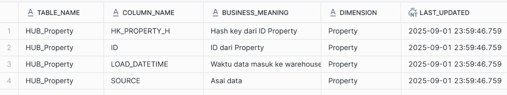
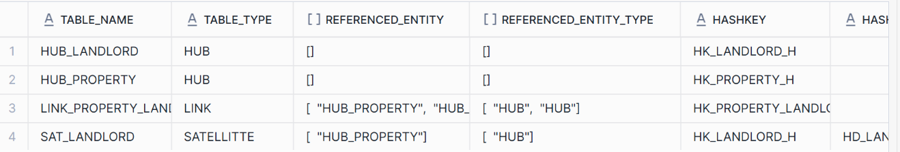
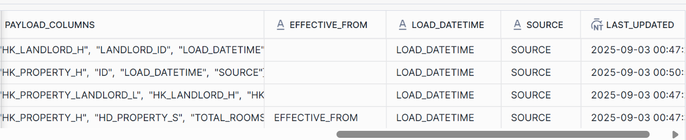
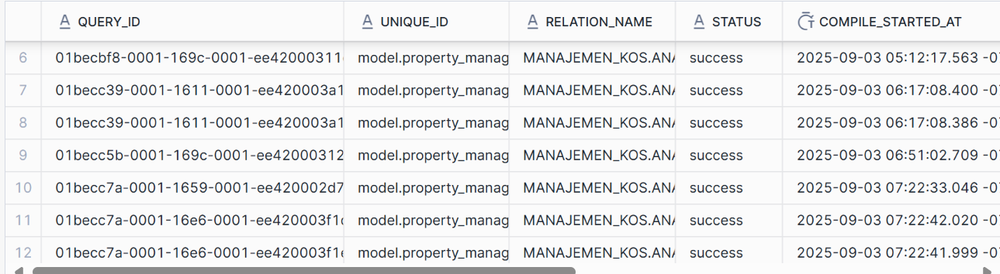
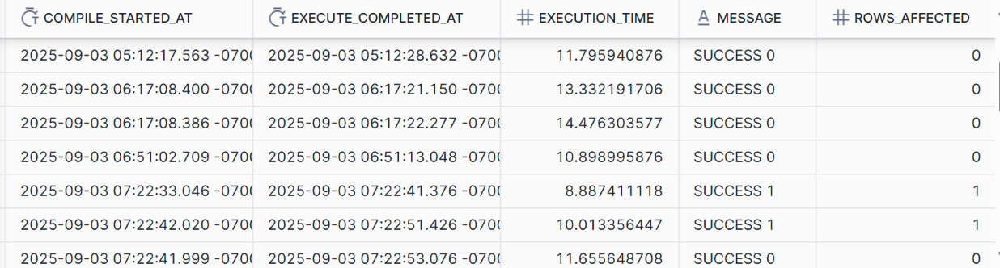
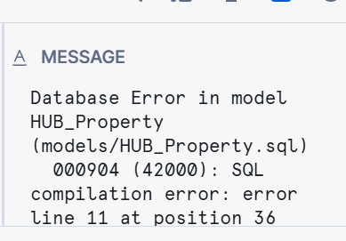
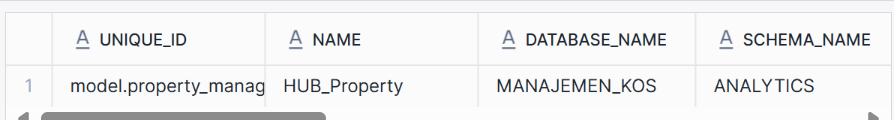
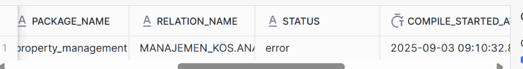
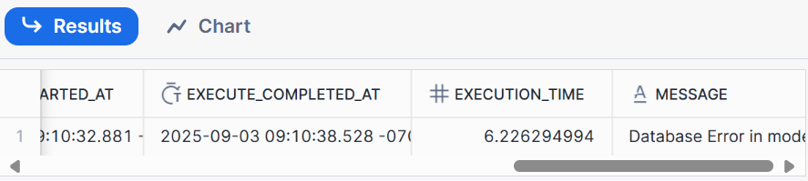

# Prequisites
1. Sediakan schema untuk meta mart di dalam snowflake
```sql
CREATE SCHEMA IF NOT EXISTS META_MART;
```

2. Sediakan tabel untuk Business, dan Technical metadata
```sql
-- Business Metadata
CREATE TABLE META_MART.BUSINESS_METADATA (
    TABLE_NAME STRING,
    COLUMN_NAME STRING,
    BUSINESS_MEANING STRING,
    DIMENSION STRING,   -- optional, misal Customer, Product
    LAST_UPDATED TIMESTAMP DEFAULT CURRENT_TIMESTAMP
);

-- Technical Metadata
CREATE TABLE META_MART.TECHNICAL_METADATA (
    TABLE_NAME STRING,
    TABLE_TYPE STRING,       -- HUB / LINK / SAT
    REFERENCED_ENTITY ARRAY,
    REFERENCED_ENTITY_TYPE ARRAY,
    HASHKEY STRING,
    HASHDIFF STRING,
    PAYLOAD_COLUMNS ARRAY,
    EFFECTIVE_FROM STRING,
    LOAD_DATETIME STRING,
    SOURCE STRING,
    LAST_UPDATED TIMESTAMP DEFAULT CURRENT_TIMESTAMP
);

-- Process Execution Metadata
CREATE TABLE MANAJEMEN_KOS.META_MART.PROCESS_EXECUTION_METADATA (
	QUERY_ID VARCHAR(16777216),
    UNIQUE_ID VARCHAR(16777216),
	RELATION_NAME VARCHAR(16777216),
	STATUS VARCHAR(16777216),
	COMPILE_STARTED_AT TIMESTAMP_TZ(9),
	EXECUTE_COMPLETED_AT TIMESTAMP_TZ(9),
	EXECUTION_TIME FLOAT,
	MESSAGE VARCHAR(16777216),
	ROWS_AFFECTED NUMBER(19,0)
);

-- Error Process Execution Metadata
CREATE TABLE MANAJEMEN_KOS.META_MART.ERROR_PROCESS_EXECUTION_METADATA (
    UNIQUE_ID VARCHAR(16777216),
    NAME VARCHAR(16777216),
    DATABASE_NAME VARCHAR(16777216),
    SCHEMA_NAME VARCHAR(16777216),
    PACKAGE_NAME VARCHAR(16777216),
	RELATION_NAME VARCHAR(16777216),
	STATUS VARCHAR(16777216),
	COMPILE_STARTED_AT TIMESTAMP_TZ(9),
	EXECUTE_COMPLETED_AT TIMESTAMP_TZ(9),
	EXECUTION_TIME FLOAT,
	MESSAGE VARCHAR(16777216)
);
```

3. Lakukan ETL load dari API property ke snowflake dan buat data vault entity yang dubtuhkan (HUB, LINK, SAT) bisa mengikuti cara di [tutorial_setting_data_vault](datavault4dbt_and_automatedv.md#automatedv)

# Jenis Metadata
## Business Metadata
Tujuan: Describe the meaning of data for business


Cara implementasi: Business metadata biasa dibuat secara manual oleh data owner yang mengerti mengenai makna masing-masing data. Contoh business metadata yang mencakup keseluruhan entitas HUB_Property:
```sql
INSERT INTO BUSINESS_METADATA VALUES(
'HUB_Property', 'HK_PROPERTY_H','Hash key dari ID Property', 'Property', current_timestamp
),
('HUB_Property', 'ID','ID dari Property', 'Property', current_timestamp),
('HUB_Property', 'LOAD_DATETIME','Waktu data masuk ke warehouse', 'Property', current_timestamp),
('HUB_Property', 'SOURCE','Asal data', 'Property', current_timestamp)
```



## Technical Metadata
Tujuan: Describes the technical aspect of data


Cara Implementasi: Menggunakan post-hook macro di dbt. Contoh untuk HUB_Property:
```sql
{{ config(
    materialized='incremental',
    post_hook=[
        "{{ merge_technical_meta(
            table_name='HUB_PROPERTY',
            table_type='HUB',
            hashkey='HK_PROPERTY_H',
            hashdiff='',
            payload_columns=['HK_PROPERTY_H', 'ID', 'LOAD_DATETIME', 'SOURCE'],
            effective_from=effective_from,
            load_datetime=LOAD_DATETIME,
            source=SOURCE,
            referenced_entity='',
            referenced_entity_type=''
        ) }}"
    ]
) }}


source_model: "properties"
src_pk: "HK_PROPERTY_H"
src_nk: "ID"
src_ldts: "LOAD_DATETIME"
src_source: "SOURCE"




{{ automate_dv.hub(
    source_model=metadata_dict['source_model'],
    src_pk=metadata_dict['src_pk'],
    src_nk=metadata_dict['src_nk'],
    src_ldts=metadata_dict['src_ldts'],
    src_source=metadata_dict['src_source']
) }}
```

isi macro:
```sql


MERGE INTO META_MART.TECHNICAL_METADATA AS target
USING (
    SELECT
        '{{ table_name }}' AS TABLE_NAME,
        '{{ table_type }}' AS TABLE_TYPE,
        ARRAY_CONSTRUCT(
            
                '{{ col }}', 
            
        ) AS REFERENCED_ENTITY,
        ARRAY_CONSTRUCT(
            
                '{{ col }}', 
            
        ) AS REFERENCED_ENTITY_TYPE,
        '{{ hashkey }}' AS HASHKEY,
        '{{ hashdiff }}' AS HASHDIFF,
        ARRAY_CONSTRUCT(
            
                '{{ col }}', 
            
        ) AS PAYLOAD_COLUMNS,
        '{{ effective_from }}' AS EFFECTIVE_FROM,
        '{{ load_datetime }}' AS LOAD_DATETIME,
        '{{ source }}' AS SOURCE
) AS source
ON target.TABLE_NAME = source.TABLE_NAME
WHEN MATCHED THEN
    UPDATE SET
        TABLE_TYPE = source.TABLE_TYPE,
        REFERENCED_ENTITY = source.REFERENCED_ENTITY,
        REFERENCED_ENTITY_TYPE = source.REFERENCED_ENTITY_TYPE,
        HASHKEY = source.HASHKEY,
        HASHDIFF = source.HASHDIFF,
        PAYLOAD_COLUMNS = source.PAYLOAD_COLUMNS,
        EFFECTIVE_FROM = source.EFFECTIVE_FROM,
        LOAD_DATETIME = source.LOAD_DATETIME,
        SOURCE = source.SOURCE,
        LAST_UPDATED = CURRENT_TIMESTAMP
WHEN NOT MATCHED THEN
    INSERT (
        TABLE_NAME, TABLE_TYPE, REFERENCED_ENTITY, REFERENCED_ENTITY_TYPE,
        HASHKEY, HASHDIFF, PAYLOAD_COLUMNS, EFFECTIVE_FROM, LOAD_DATETIME, SOURCE
    )
    VALUES (
        source.TABLE_NAME, source.TABLE_TYPE, source.REFERENCED_ENTITY, source.REFERENCED_ENTITY_TYPE,
        source.HASHKEY, source.HASHDIFF, source.PAYLOAD_COLUMNS, source.EFFECTIVE_FROM, source.LOAD_DATETIME, source.SOURCE
    );


```

Kelemahan:
- Belum bisa fully automated karena Post-hook dieksekusi saat compile SQL, bukan runtime Python/Jinja biasa, sementara metadata_dict hanya tersedia di scope file model itu sendiri saat render model. Sehingga parameter pada pemanggilan macros harus ditulis secara manual
- Pencatatannya baru bisa ke table level, belum ke column level


Pertimbangan:
- memakai manifest.json daripada post-hook macros yang semi-manual, tetapi di manifest.json tidak ditampilkan relationship antar model




## Process Execution Metadata
Tujuan: Provides statistic about running ETL processes


Cara implementasi: 
### Cara Lama
Parse file run_results.json yang akan tergenerasi setiap kali dbt melakukan run. Ubah ke bentuk dictionary dan load ke dalam data warehouse menggunakan dlt. File json = [json](run_results.json)

- Parsing json menjadi dictionary
```py
def parse_dbt_run_results_to_dict(json_path: str):
    with open(json_path, "r") as f:
        data = json.load(f)
    
    for result in data.get("results", []):
        compile_start = None
        execute_end = None
        for t in result.get("timing", []):
            if t["name"].lower() == "compile":
                compile_start = t.get("started_at")
            elif t["name"].lower() == "execute":
                execute_end = t.get("completed_at")
        
        adapter_resp = result.get("adapter_response", {})
        
        yield {
            "query_id": adapter_resp.get("query_id"),
            "status": result.get("status"),
            "compile_started_at": compile_start,
            "execute_completed_at": execute_end,
            "execution_time": result.get("execution_time"),
            "_message": adapter_resp.get("_message"),
            "rows_affected": adapter_resp.get("rows_affected"),
            "unique_id": result.get("unique_id"),
            "relation_name": result.get("relation_name")
        }
```

- dlt resources
```py
@dlt.resource(name="process_execution", write_disposition="append", table_name="PROCESS_EXECUTION_METADATA")
def process_execution_resource():
    yield from parse_dbt_run_results_to_dict(RUN_RESULTS_PATH)
```

- pipeline
```py
def run_metadata_pipeline():
    pipeline = dlt.pipeline(
        pipeline_name="metadata_insert",
        destination="snowflake",
        dataset_name="META_MART"
    )
    load_info = pipeline.run(process_execution_resource())
    print(load_info)
```

### Cara Baru
Menggunakan on-run-end hook yang akan menjalankan perintah sql setiap kali dbt run atau build 

```yml
on-run-end:
  - |
      
      insert into META_MART.PROCESS_EXECUTION_METADATA
      values (
          '{{ result.adapter_response.get("query_id","") if result.adapter_response is defined else "" }}',
          '{{ result.node.unique_id }}',
          '{{ result.node.relation_name }}'null,
          '{{ result.status }}',
          
          '{{ compile_time }}'null,
          
          '{{ execute_time }}'null,
          {{ result.execution_time | default(0) }},
          '{{ result.message | replace("'", "''") }}',
          {{ result.adapter_response.get("rows_affected", "null") if result.adapter_response is defined else "null" }}
      );
      
```

Penjelasan:
- Setiap kali melakukan run/build, dbt akan membuat sebuah object bernama results(nantinya dibuat menjadi run_results.json yang kita gunakan di metode sebelumnya)
- Ambil variabel-variabel yang diperlukan dalam object results untuk diinsert ke dalam data warehouse.


Notes:
- Kalau mau ambil variabel dari object results, jangan terpaku sama struktur filenya di json. Sebaiknya print keseluruhan isi object dalam bentuk string untuk liat struktur (karena sempet makan waktu banyak pas mau ambil unique_id yang kalau secara logika saat mengamati struktur file json terletak di result.unique_id, dan baru ketahuan setelah di print isi object bahwa unique_id diakses di result.node.unique_id)





Kolom message apabila terjadi error dalam run


## Error Process Execution Metadata
Tujuan: Berisi mengenai info tabel yang gagal diload


Cara Implementasi: Gunakan on-run-end hook
```yml
- |
      
          
              insert into META_MART.ERROR_PROCESS_EXECUTION_METADATA 
              values (
                  '{{ result.node.unique_id }}',
                  '{{ result.node.name }}',
                  '{{ result.node.database }}',
                  '{{ result.node.schema }}',
                  '{{ result.node.package_name }}',
                  '{{ result.node.relation_name }}'null,
                  '{{ result.status }}',
                  
                  '{{ compile_time }}'null,
                  
                  '{{ execute_time }}'null,
                  {{ result.execution_time | default(0) }},
                  '{{ result.message | replace("'", "''") }}'
              );
          
      
```

Hasil Tabel:




