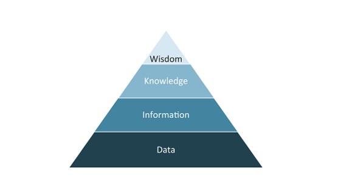
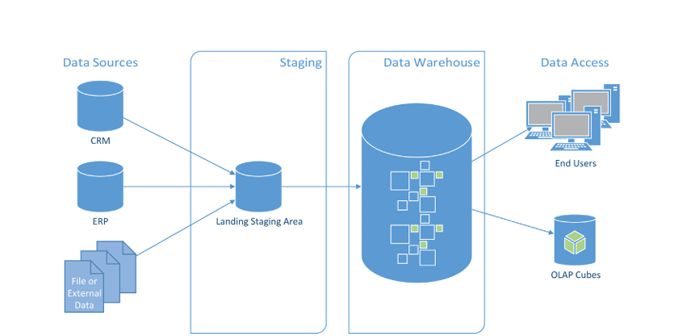
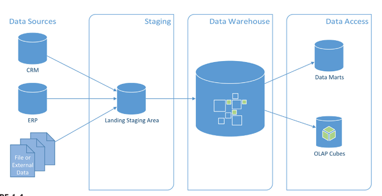
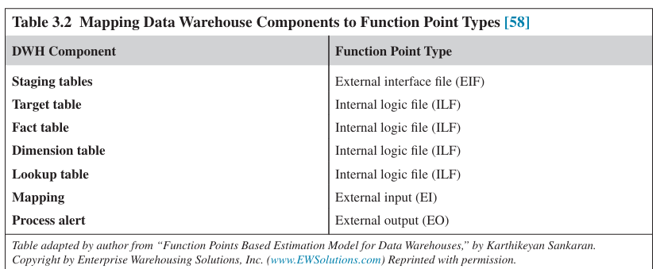
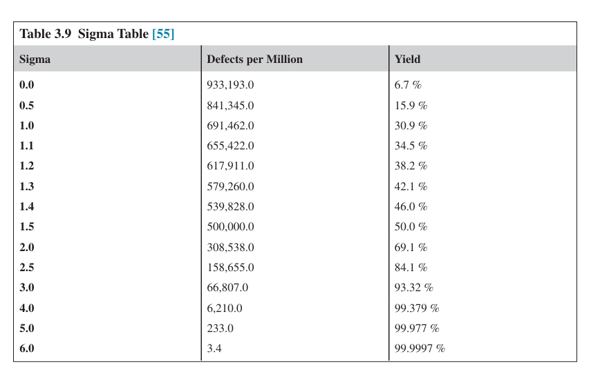
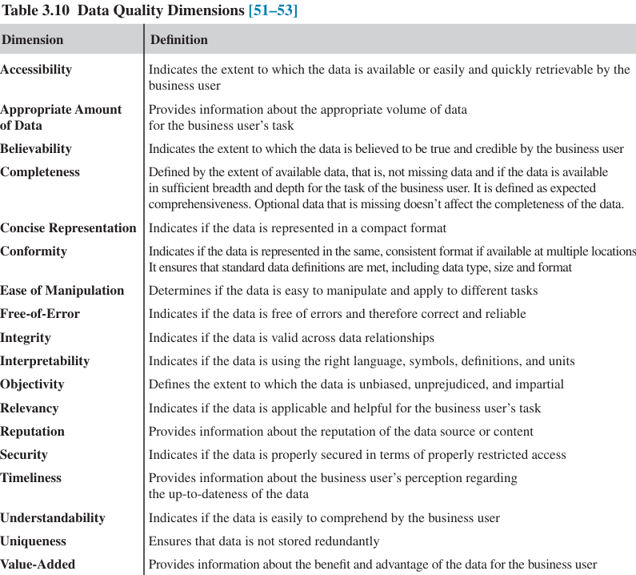
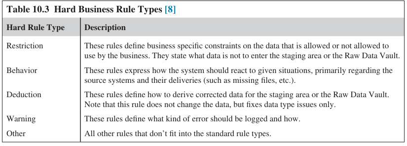

# Chapter 1 - INTRODUCTION TO DATA WAREHOUSING
## Information Hierarchy

- Data: Raw facts without context.
- Information: Organized data with relevance and purpose.
- Knowledge: Synthesized information enriched by experience.
- Wisdom: Applied knowledge in novel or complex situations.

## History of Data Warehousing
### Decision Support Systems
a DSS is comprised of an analytical models database that is fed with selected data extracted from source systems. The raw data is aggregated within the analytical models database or on the way into the system.

### Data Warehouse Systems
The data warehouse provides nonvolatile, subject-oriented data that is integrated and consistent to business users on all targeted levels. Subject orientation differs from the functional orientation of an ERP or operational system by the focus on a subject area for analysis.

The integration of the various data sources within or external to the organization is performed on the business keys in many cases. This becomes a problem if a business object, such as a customer, has different business keys in each system. Which is why on the next part we're talking about the new solution: EDW.

### Enterprise Data Warehouse (EDW)
Instead of focusing on a single subject area for analysis, an enterprise data warehouse tries to represent all of an organization’s business data and its business rules. The data in the warehouse is then presented in a way that all required subject areas are available to business users.

#### Key Features of EDW
- Access: Fast, intuitive, and meaningful data access for users.
- Multiple Subject Areas: Tailored data marts for different departments.
- Single Version of Truth: Unified, validated data across the organization.
- Single Version of Facts: Complete raw data retained for compliance and auditing.

#### Technical and Strategic Requirements
- Mission Criticality: EDWs are vital for strategic decisions and operational support.
- Scalability: Must handle growing data volumes and user demands.
- Big Data: Must manage volume, velocity, and variety of data.
- Performance: Efficient data loading and query response times are crucial.
- Complexity: Challenges in sourcing, transforming, and loading data.
- Auditing & Compliance: Traceability of data sources and processes is essential.
- Cost Management: Includes storage, quality, planning, and adaptability to changing requirements.

## Data Vault 2.0
- Modeling: Optimized for performance and scalability.
- Methodology: Agile and Scrum-based practices.
- Architecture: Supports NoSQL and big data systems.
- Implementation: Automated and pattern-based for efficiency.

## Data Warehouse Architecture
### 2-Layers model

Layers:
- Staging
- Dimensional Data Marts

The raw data from the source systems is loaded into the stage area. The goal is to have an exact copy of all data that should be loaded into the data warehouse. Once the data has been loaded to the stage area, the data will be loaded into the data warehouse.

The advantage of a two-layered architecture is that it is easy to build a dimensional store from the source data as compared to other architecturess. However, the disadvantage is that it is more complex to build a second dimensional model from the same source data because the data needs to be loaded again from the staging. It is not possible to reuse existing ETL packages

### 3-Layers model

Layers:
- Staging
- ODS/EDW (normalized)
- Dimensional Data Marts

The staging area temporarily stores raw data extracted from various source systems. The data warehouse holds raw data modeled in a third-normal form. It integrates all data of the enterprise, but is still based on physical tables from the source systems. On top of the normalized view of the business data, there is a dimensional model. Business users can access and analyze the data using subject-oriented data marts.

# Chapter 2 -SCALABLE DATA WAREHOUSE ARCHITECTURE
Best approach = Cycle/Sprint over Big Bang

## Dimension of Scalable Warehouse Architecture
### Workload
Growing data volumes and user concurrency require parallel processing (MPP/SMP).

### Data Complexity
Following factors contributing to the growth of data complexity:
- Variety of data
- Volume of data
- Velocity of data
- Veracity (trustworthiness) of data

### Analytical Complexity
Due to the availability of large volumes of data with high velocity and variety, businesses demand different and more complex analytical tasks to produce the insight required to solve their business problems. Some of these analyses require that the data be prepared in a fashion not foreseen by the original data warehouse developers.

### Query Complexity
SQL optimization and performance tuning are critical for large-scale queries.

### Availability
SLAs require high uptime; solutions include clustering and parallel data loads. The availability of a data warehouse system might be affected by added functionality. One example is the addition of new data sources that have to be loaded and integrated into a new data mart. This, however, would extend the time needed to load all data sources and build the data marts.

### Security
Larger, diverse datasets need robust governance and protection mechanisms.

## Data Vault 2.0 Architecture
The Data Vault 2.0 architecture addresses the extensibility and dimensions of scalability by modifying a typical three-layer data warehouse architecture [3_layers_model](#3-layers-model)

Here's the modification:
- A staging area which does not store historical information and does not apply any changes to the data, except ensuring the expected data type.
- A data warehouse layer modeled after the Data Vault modeling technique.
- One or more information mart layers that depend on the data warehouse layer.
- An optional Metrics Vault that is used to capture and record runtime information.
- An optional Business Vault that is used to store information where the business rules have been applied. In many cases, the business rules change or alter the data when transforming it into useful information.
- An optional Operational Vault that stores data fed into the data warehouse from operational systems.
- Capabilities for managed self-service BI.

### Business Rules
#### Definition
Generally stated, business rules modify the incoming data to fit the requirements of the business.Hard business rules are the technical rules that align the data domains, so-called data type matching. As a rule of thumb, hard business rules never change the meaning of the incoming data, only the way the data is stored. Opposite from hard business rules, soft business rules enforce the business requirements that are stated by the business user. These business rules change the data or the meaning of the data.

#### Application
In data warehousing, business rules can be divided into hard rules, which enforce technical constraints such as data types and must be applied in the staging area, and soft rules, which transform or interpret data to fit business requirements. Traditional two- and three-layer architectures often apply both types of rules early in the ETL process, which creates heavy dependencies and makes adapting to changing business rules complex and costly. Data Vault 2.0 addresses this by separating hard and soft rules: only hard rules are enforced during loading, while soft rules are deferred to the information mart layer. This approach preserves historical data, avoids breaking ETL jobs when business rules change, and provides greater flexibility, scalability, and adaptability for evolving business needs.

### Staging Area Layers
The staging layer is used when loading batch data into the data warehouse. Its primary purpose is to extract the source data as fast as possible from the source system in order to reduce the workload on the operational systems. In addition, the staging area allows the execution of SQL statements against the source data, which might not be the case with direct access to flat files, such as CSV files or Excel sheets.

### Data Warehouse Layer
The second layer in the Data Vault 2.0 architecture is the data warehouse, the purpose of which is to hold all historical, time-variant data. The data warehouse holds raw data, not modified by any business rule other than hard business rules. Therefore, the data is stored in the granularity as provided by the source systems. The data is nonvolatile and every change in the source system is tracked by the Data Vault structure.

### Information Mart Layer
Typically, the end-user accesses only the information mart which provides the data in a way that the end-user feels most comfortable with. The information in the information mart is subject oriented and can be in aggregated form, flat or wide, prepared for reporting, highly indexed, redundant and quality cleansed.

### Metrics Vault
The Metrics Vault is used to capture and record runtime information, including the run history, process metrics, and technical metrics, such as CPU loads, RAM usage, disk I/O metrics and network throughput.

### Business Vault
The Business Vault is a sparsely modeled data warehouse based on Data Vault design principles, but houses business-rule changed data. In other words, the data within a Business Vault has already been changed by business rules. 

### Operational Vault
The Operational Vault is an extension to the Data Vault that is directly accessed by operational systems  There are occasions when such systems need to either retrieve data from the enterprise data warehouse or when they need to write data back to it. Examples include master data management (MDM) systems, such as Microsoft Master Data Services (MDS) or metadata management systems. In both cases, there is an advantage of directly operating on the data warehouse layer instead of using an information mart or staging area. Other cases include data mining applications that directly analyze the raw data stored within the data warehouse layer. Often, whenever the interfacing application requires real-time support, whether reading or writing, direct access to the Operational Vault is the best option.

### Managed Self-service BI
An approach called self-service BI allows end-users to completely circumvent IT due to its unresponsiveness. In this approach, business users are left on their own with the whole process of sourcing the data from operational systems, integration, and consolidation of the raw data.

But, of course there's many setbacks to this approach, including:
- Direct access to source systems: end-users should not directly access the data from source systems.
- Unintegrated raw data: when sourcing data from multiple source systems, business users are left alone with raw data integration. This can become a tedious and error-prone task if performed manually
- Low data quality: data from source systems often have issues regarding the data quality.
- Unconsolidated raw data: in order to analyze the data from multiple source systems, the data often requires consolidation. Without this consolidation, the results from business analysis will be meaningless.
- Nonstandardized business rules: because end-users are dealing with only the raw data in self-service BI, they have to implement all business rules that transform the raw data into meaningful information.

# Chapter 3 - THE DATA VAULT 2.0 METHODOLOGY
## Project Planning
- Alpha Release: distributed to technical business analysts. The data here has not have any business rules yet
- Beta Release:  has been tested thoroughly by IT and business representatives and no longer contains any obvious or known errors.
- Gamma Release: using a more user-friendly schema and is made available to all business users.

### Capability Maturity Model Integration
a process improvement framework that has been developed to address a broad range of application environments. There are three different models based on the CMMI framework.

- CMMI for Development, a process model for process management and improvement in software development organizations.
- CMMI for Acquisition, a model for organizations that have to initiate and manage the acquisition of products and services
- CMMI for Services, a process model for organizations to help them to deploy and manage services

#### Capability Level
- Level 0(Incomplete): It indicates that processes are not, or only partially, performed. It also indicates that at least one specific goal of the process area is not satisfied.
- Level 1(Performed): if all generic goals of level 1 are satisfied. This level requires that processes are performed and produce the needed output. However, this level doesn’t require that the process itself be institutionalized, which means that process improvements can be lost over time.
- Level 2(Managed): requires a process that is planned and executed in accordance with policy. All relevant stakeholders are involved in the process, which is monitored, controlled, reviewed and evaluated on a regular basis
- Level 3(Defined): It is characterized by a defined process which is a managed process derived from the organization’s set of standard processes and derived to the needs of the circumstances.
- Level 4(Quantitively Managed): A defined process (see capability level 3) that uses statistical and other quantitative methods to control selected subprocesses.
- Level 5(Optimizing): Focuses on the institutionalizing of an optimizing process.

#### Maturity Level
- Level 1(Initial): Indicates an organization with ad-hoc and chaotic processes. There is no stable process environment provided by the organization.
- Level 2(Managed): Have processes that are planned and executed in  accordance with policy and that involve all relevant stakeholders.
- Level 3(Defined): Indicates well-characterized and understood processes which are described in standards, procedures, tools, and methods
- Level 4(Quantitively Managed): Organizations use quantitative objectives for quality and process performance for managing their projects
- Level 5(Optimizing): Continually improve their processes using a quantitative approach to understand the variation of their processes and their process outcomes. 

### Integrating CMMI In the Data Vault 2.0 Methodology
- Measurable: will describe how the estimation process in the Data Vault 2.0 methodology is based on the comparison of estimated and actual effort.
- Repeatable: Repeatable processes.
- Defined: Promotes defined standards, rules, procedures and prebuilt templates, including project documentation. 
- Flexible
- Scalable
- Monitored: Consistent team reviews as in Scrum and constant releases in each sprint make sure that business users don’t lose interest in the project and its activities.
- Governed
- Optimized

### Managing the Project
#### Scrum
Waterfall approach. If everything goes well (and as planned), the waterfall approach is the most efficient way to carry out a project. However, it is almost impossible to carry out larger projects where the customer is not very concrete with requirements and ideas and where the business requirements evolve over time.

#### Iterative Approach
The previous section has already discussed that Scrum uses an iterative approach for developing the final system. Each iteration is a small step towards the final solution and adds more value to the product.

#### Product and Sprint Backlog
User requirements are maintained as user stories in a product backlog in Scrum. They are prioritized by business value and include requirements regarding customer requests, new features, usability enhancements, bug fixes, performance improvements, re-architecting, etc. 

User stories describe features from a user’s perspective and are kept in the product backlog until a team member selects a user story for implementation. The user stories are implemented in iterations called “sprints” which last usually two to four weeks. At the beginning of the project, user stories tend to be more general, roughly describing the primary features of the business users. 

### Defining the Project
There's 2 common objections in this stage: don't implement all tables from a source to keep the costs of integrating source systems low and don't be afraid touch the target multiple times in order to implement the final solution.

1st objection reasoning:
- Avoid expensive ETL and Infrastructure

2nd objection reasoning:
- Delivering small feature for each sprint is much safer

#### Agile Requirements Gathering
- Identify the required data
- Produce raw mart
- Produce raw report
- Gather business rules and other requirements
- Translate business rules and other requirements

### Estimation of the Project
#### Function Point Analysis
The functional characteristics of software are made up of external inputs (EI), which is the data that is entering a system; external outputs (EO) and external inquiries (EQ), which is data that leaves the system one way or another; internal logical files (ILF), which is data manufactured and stored within the system; external interface files (EIF), which is data that is maintained outside the system but necessary to perform the task.

#### Measuring with Function Point
- determine function point count type.
- identify the counting boundary
- identify and count data function types
- identify and count transactional function types
- determine unadjusted function point count
- determine value adjustment factor
- calculate final adjusted function point count

## Project Execution
1. Envision initial architecture
2. Model details just-in-time
3. Prove architecture early
4. Focus on usage
5. Avoid focusing on “the one truth”
6. Organize work by requirements
7. Active stakeholder participation

### Traditional SDLC
#### Requirements Engineering
- Business area	data requirements
- Architecture requirements
- Audit	requirements
- Archive requirements

#### Design
During the design phase, the data warehouse designers design the architecture of the data warehouse, such as the layers and each module of the system. The definition is based on the “Data Warehouse Definition” document and includes the database definitions of each layer, such as the structure of the staging area tables, the tables in the data warehouse layer and the star schema in the data mart.

#### Implementation and Unit Testing
Once the data warehouse has been described (in the requirements engineering phase) and designed (in the design phase), the individual modules of the system are implemented by the data warehouse developers. While they develop the modules, they also test the modules and remove errors found in this process.

#### Integration and System Testing
The individual units are connected to each other and integrated. This integration process starts with some modules at the bottom of the architecture which are fully integrated and tested.

#### Operation and Maintenance
In the last phase of the waterfall model, the data warehouse is handed over to operations where the system is installed at the end-user premises for regular use. If end-users find bugs in the data  warehouse, the operations team is responsible for correcting those bugs and handling other modifications of the data warehouse. This continuous process is performed until the data warehouse retires or is replaced by a new data warehouse

## Review and Improvement
### Six Sigma

- DMAIC (Define – Measure – Analyze – Improve – Control) -> fix existing process
- DMADV (Define – Measure – Analyze – Design – Verify) -> create new product with high standard

In this implementation, we use DMAIC
1. define the problem and clearly describe the impact on customer satisfaction stakeholder’s employees, and profitability.
2. measure the current performance to identify opportunities for improvement.
3. search for the root cause during the analyze phase. Opportunities for improvement are prioritized by two dimensions: their contribution to customer satisfaction and the impact on profitability.
4. The improvement step implements the opportunities identified in the previous step. Project members develop solution candidates and select the solution with the best results and performance.
5. The last step of DMAIC improvement is the control step. Its goal is to control the improved processes and to make sure that the Six Sigma initiative sustains.

### Total Quality Management

- Total Data Quality Management -> ensuring that data is fit for use and continuously improved, just like physical products in manufacturing.
- Data Warehouse Quality -> not only clean and reliable data, but also the performance, usability, and business value of the entire warehouse system.

# Chapter 4 -  DATA VAULT 2.0 MODELING
- hub -> separates the business keys from the rest of the model
- link -> stores relationships between business keys
- satellites -> store the context (the attributes of a business key or relationship)

### Hub Entities
When business users access information in an operational system, they use a business key to refer to the business objects. This might be a customer number, invoice number, or a vehicle identification number. 

### Link Entities
The Data Vault models these relationships with links that connect two or more hubs. Typical business processes are purchasing, manufacturing, advertising, marketing, and sales. Because these processes often (but not always) represent transactions, a link often represents a transaction as well. 

### Satellite Entities
The missing piece is the context of these business objects and the context of these links. For a flight transaction, this might be the air time of the plane or the security delay of a flight.

## Hub Definition
Hubs are defined using a unique list of business keys and provide a soft integration point of raw	data that is not altered from the source system, but is supposed to have the same semantic meaning. Therefore, business keys in the same hub should have the same semantic granularity.

### Business Key
Business keys are used to identify, track, and locate information. By definition, a business key should have a very low propensity to change and should be unique.

### Structure
1. Hash Key
2. Business Key
3. Load Date
4. Record Source
5. Last seen date

## Link Definition
The link entity type is responsible for modeling transactions, associations, hierarchies, and redefinitions of business terms. Links capture and record the past, present, and future relationships between data elements at the lowest possible granularity. 

Don’t put Begin/End dates directly in Links, doing so makes the model rigid and unable to capture multiple, temporary, or reversible changes. Instead: keep Links timeless, and capture timelines/context in Satellites.

### Structure
1. Hash Key
2. Load Date
3. Record Source
4. Last Seen Date
5. Dependent child key

## Satellite Definition
Satellites store all data that describes a business object, relationship, or transaction. They add context at a given time or over a time period to hubs and links. However, this context often changes in a business – thus the descriptive data in a satellite also changes over time. The purpose of a satellite is to track those changes as well.

### Splitting Satellite

#### By Source System
It is recommended practice to split the incoming data first by the source system. That means that each incoming data set is kept in individual satellites, which are in turn dependent on their parent (either a hub or link). 

#### By Rate of Change
Those attributes that are frequently changed are stored in one satellite, and those attributes that change less frequently are stored in another. If there are more than two frequencies, there	should be more than two satellites.

### Structure
1. Load Date
2. Record Source
3. Parent Hash Key
4. Load End Date
5. Extract Date
6. Hash diff

## Link Driving Key
Without the driving key concept, the hub entries would be completely independent from each other. The satellite entries would depend on these independent link entries, having nothing to do with each other. 

# Chapter 5 - INTERMEDIATE DATA VAULT MODELING
## Hub Application
### Business key consolidation
Since multi-source may have a multiple kind of business keys for the same entity, it is best to use same-as link that's stored at another hub. same-as link is a special link to record many business keys that are actually referring to the same entity.

## Link Application
- Don't use link-on-link, make them independent
- Same-as link
- Hierarchical links -> used to model parent-child hierarchies using Data Vault links.
- Nonhistorized links -> stored the supposedly non-updateable event
- Nondescriptive links -> links that doesn't have any satellite
- Computed aggregated links ->  removes one hub from a link and aggregates the data by the remaining relationships.
- Exploration links -> computed links that have been created for business reasons only. 

## Satellite Application
- Overloaded satellite -> dumping the multi-source data into 1 satellite 
- Multi-active satellite -> store multiple entries per parent key. However, these records don’t come from different sources, but from a denormalized data source
- Status tracking satellite -> load audit trails or data from change data capture (CDC) systems
- Effectivity satellite -> track the effectivity of a relationship between two business objects among other applications 
- Record tracking satellite -> trace the metadata of the data changes itself
- Computed satellite ->  storing computed data, which 
is data that is the result of aggregation, summarization, correction, evaluation, etc. It might be the outcome of data quality routines, cleansing routines or address correction routines.

# Chapter 6 - ADVANCED DATA VAULT MODELLING
## Point-in-Time Table
In Data Vault, hubs and satellites are separate. To get the “state of data at a certain time,” you usually need to join multiple satellites → this can be slow.

Makes historical queries easier and faster in a Data Vault. PIT table stores snapshot keys and timestamps, so queries can directly join PIT → satellite records.

### Structure
1. Hub ID
2. Load Date
3. Foreign key to the latest satellite records

## Bridge Table
Handles many-to-many relationships between hubs.

### Structure
1. Hub A ID
2. Hub B ID
3. Aggregated data (optional)

## Reference table
Stores static or rarely changing lookup data.

### No-History Reference table
The most basic reference table is just a typical table in third or second normal form. This basic table is used when there is no need to store history for the reference data. That is often the case for reference data that is not going to change or that will change very seldom.

### History-based Reference table
Using satellite connected to the reference table if it needed to be historized

# Chapter 7 - DIMENSIONAL MODELING
## Star Schemas
Using denormalized form of table. Structure including:
1. Fact Table: holds the measures of the business,
2. Dimension Table: group the facts into categories and provide additional descriptive attributes to these categories

## Multiple Stars
This behavior is supported by conformed dimensions, which are used by multiple stars (a fact table with its dimension tables) and therefore connect these individual stars via the conformed dimension itself.

## Dimension Design
### Slowly Changing Dimension
- Slowly changing dimension type 0: preserves the initial dimensional attribute values. If a change occurs in the source system, the value in the dimension is not changed.
- Slowly changing dimension type 1: The dimension’s attribute always reflects the most current value.
- Slowly changing dimension type 2: changes in the source system add a new row.
- Slowly changing dimension type 3: track history in additional columns.
- Slowly changing dimension type 4: this type puts volatile attributes into a separate mini-dimension table.
- Slowly changing dimension type 5: a hybrid between type 4 and type 1 dimensions (4 + 1 equals 5). It allows access of the currently assigned mini-dimension attributes along with the base dimension’s others without linking through a fact table.
- Slowly changing dimension type 6: this type adds current attributes to a type 2 dimension.
- Slowly changing dimension type 7: this type achieves the same functionality as type 6 dimensions but with dual foreign keys added to the fact table: one that references a type 2 dimension with the tracked attributes, while the other one references the current row.

### Hierarchies
They allow drilling down of data in order to analyze the data in more detail. Consider the following example: An Excel PivotTable presents worldwide passenger revenue of several years in total values. Each level of the hierarchy is based on one of the physical attributes of the dimension table.

### Snowflake Design
allows indirect dimension tables join. This is useful if the relationships between dimension attributes should be modeled explicitly. 

# Chapter 8 - PHYSICAL DATA WAREHOUSE DESIGN
Workload Characteristic:
1. Data latency
2. Consistency
3. Updateability
4. Data types
5. Response time
6. Predictability

## Seperate Environmnet for Development, Testing and Production
### Blue-Green Deployment
- Blue → the version currently live (production).
- Green → the new version (update/upgrade).

When the new version is ready, user traffic is switched from Blue → Green quickly. If something goes wrong, you can roll back immediately by redirecting traffic back to Blue.

## Physical Data Warehouse Architecture on Premise
- Data Size
- Volatility
- Number of business processes
- Number of users
- Nature of use
- Service level agreement

## Hardware Architecture and Databases
- Single Server
- Scalable Shared Databases ->  allow user of a read-only database in multiple server instances
- Massively parallel processing (MPP) -> allows the distribution of data to multiple nodes on the grid. 

### Storage options
- RAID-0 -> Splits (stripes) data across multiple disks.
- RAID-1 -> Data is duplicated (mirrored) on two or more disks.
- RAID-5 -> Data striped across disks, and parity distributed across all disks (no single parity disk).
- RAID-6 -> Like RAID 5, but with two parity blocks distributed across disks.

## Database option
### TempDB
system database used to store temporary objects and data.

### Partitioning
Partition is used when the data in a table or index becomes too large to manage by SQL Server 2014. If the data is too big, the performance of maintenance functions, such as backup or restore, can drop.

### Filegroups
Filegroups are used in order to distribute the partitions in a partition scheme  to multiple physical disks or RAID arrays. Filegroups can also be used to separate row data from indices. Such a strategy can improve the performance if the data is distributed to different physical drives with their own disk controllers. It allows the database server to read row and index data independently from each other in parallel because multiple disk heads are reading the pages.

### Data Compression
While data compression consumes more CPU power, it uses less I/O to store and retrieve the same amount of data.

## Setting Up the Data Warehouse
### Stage Area
The goal of the stage area is to stage incoming data in order to reduce the workload on the operational systems and shorten the access time to them. The stage area is defined as a temporary storage of the incoming data. It can be a relational database system or a NoSQL storage. Therefore, the goal of the stage area is to collect the incoming data as fast as possible.

### Data Vault
The purpose of the Data Vault layer is to permanently store the enterprise data with all its history. The goal of the Data Vault layer (the data warehouse layer) is to keep a nonvolatile copy of every change of data in multiple source systems, integrated using the business key.

The Data Vault layer also gathers and retains the metadata, metrics data and information about errors. A good practice is to separate each vault using database schemas.

### Information Marts
Both the Business Vault and information marts have much more tolerance to hardware faults than the Raw Data Vault. That doesn’t mean that we welcome hardware faults in the information marts, as it would be a lot of work to replace the disks and rebuild the databases used by the information marts. However, our statement is that it is possible to recreate them without any data loss. Our recommendation is to use individual databases for information marts.

### Meta, Metrics, Error Marts
The Meta Mart, Metrics Mart, and Error Mart are special instances of information marts which are primarily used by IT to analyze internals of the data warehouse.

- Metrics mart: Because it can be rebuilt and reloaded very easily, it can be stored on less reliable RAID configurations, such as RAID-0.
- Meta mart:  Because it is the central place of storage, it has higher reliability requirements than other information marts. Instead, the requirements are comparable to the raw Data Vault layer, where a RAID-5 or RAID-1 level is typically used.
- Error mart: It is the central location of all error information in the data warehouse. Therefore, it should be kept on RAID-5 or RAID-1.

# Chapter 9 - MASTER DATA MANAGEMENT
## Definition
### Master Data
Master data describes the business entities, which are part of the business processes implemented in operational systems of the organization. 

Type:
- Operational Master Data
- Analytical Master Data

### Data Management
Data management includes the development and execution of architectures, practices, procedures and policies which are required to effectively manage an enterprise information life cycle. Its purpose is to plan, control and deliver the data and information assets required by the organization.

## Master Data Management
MDM is the creation of a single, well-defined version of all the data entities in the enterprise, the so-called “golden records” – in other words, a single copy of a record representing a single business concept like customer, or product, or order, or sale and so on.

### Goals
- Improve the quality of the data
- Facilitate receiving, processing and checking of information
- Facilitate exchange of data
- Reduce information requirements

## Drivers for Managing Master Data
Benefit from managing master data:
- Consistent master data
- Complete master data
- Correct format of master data
- Master data attributes within range
- Complex data handling
- Deduplicated master data

# Chapter 10 - METADATA MANAGEMENT
## What is Metadata
Metadata is all data about other data that is “needed to promote its administration and use” 

- Back Room Metadata: this metadata is process related and describes the extraction, cleaning and loading processes. Its main purpose is to help the database administrator (DBA) or the data warehouse team to load the data into the data warehouse.
- Front Room Metadata: this metadata is more descriptive and is used in query tools and report tools. It primarily benefits end-users and helps them to understand the technical solution when building front-end solutions.

Category by areas in data warehouse:
- Business metadata: describes the meaning of data for the business.
- Technical metadata: describes the technical aspects of data, including data types, lineage, results from data profiling, etc. 
- Process execution metadata: provides statistics about running ETL processes, including the number of records sourced and loaded to the destination, number of rows rejected and the time it took to load the data.

## Business Metadata
Business metadata describes the meaning of data for the business.

list:
- Business column names
- Business definitions: for each attribute, table and other object, including soft business rules of the information mart, there should be a business description of the attribute’s, table’s or object’s business meaning
- Ontologies and taxonomies: these business definitions describe the business objects behind the source data and the relationships to other business objects or the hierarchies that describe the business object itself. 
- Physical table and column names: because front-end tools often present information to endusers with references to business names only, the business metadata needs to track the physical names that belong to the business names.
- Technical numbering used to identify data elements in the technical model.

Metadata that looks technical but can also be meant for business:
- Record source: Because business users should be able to trace back data to a real-world source system they recognize. (Example: "Flight Tracking Database" or "Passenger Information System," not "dbserver01\prod01.")
- Table specifications: Because business needs to understand what data is available and why it exists. (Example: Instead of saying "tbl_pas_01," describe it as "Passenger Personal Info Table – contains home address data.")
- Hard exception-handling rules: Because business stakeholders need visibility into data quality handling, not just engineers. (Example: "If passenger date of birth is missing, reject record and send to error log.")
- Source system business definitions: a dictionary of the data elements in the source system, but explained in business language. (Example: Instead of just saying “column: PASS_ADDR,” you write: “Home Address of the Passenger, as captured in the Passenger Information System (Personal Module).”)
- (Soft) business rules: explain why the source data looks the way it does and help avoid duplicate or wrong transformations later. (Example: A system may prevent saving a booking without a passenger’s last name.)

## Technical Metadata
Most technical metadata is around technical components of the data warehouse.

list:
- Source systems: this type of metadata provides technical information about the source systems including the source database or flat file location and staging area tables used.
- Data models: are the physical and logical data models, often presented in a graphical format, and provide information about the relationships between tables.
- Data definitions: this list provides technical definitions of all columns in a data source. 
- Business rules: the technical definitions of business rules are also considered as technical metadata because they need to be implemented in ETL later on.
- Volumetrics: there should be information about the table size and growth patterns of the source tables to estimate the workload of the data warehouse for this source table.
- Ontologies and taxonomies: technical metadata should also provide information about ontologies and taxonomies, including abbreviations of terms and attributes, relationships, business key designations, peers and parents, hierarchies and re-defines (cross-ontologies matching at a structure level).
- Data quality: this kind of metadata provides information about standardization of source data and other data quality metrics.

## Process Execution Metadata
Process execution metadata is generated by the data warehouse team and provides insights into the ETL processing for maintenance. 

list:
- Control flow metadata: a control flow executes one or more data flows among other tasks. 
- Data flow metadata: the data flow log provides information about the performance of data flows and how many records have been processed or rejected by each transformation.
- Package metadata: a package executes a control flow. The package metadata provides summary information about the running time of the package.
- Process metadata: most packages are executed by SQL Server Agent or another scheduling application. The process metadata provides information about the process that has started the package.

## Implementing the Meta Mart
The Meta Mart is the central piece for collecting business and technical metadata in the Data Vault 2.0 architecture. The Meta Mart provides a set of tables that are used to collect the metadata of the data warehouse.

### Naming Conventions
Set your mind to use prefix, suffix, Camel Case, or underscores to name your table. For example:

1. H_Customer
2. HUB_Customer
3. HubCustomer
4. CustomerHub

When naming Raw Data Vault satellites, it is recommended to include an abbreviation for the source system because, in many cases, there are multiple satellites hanging off the parent hub or link. But if each source system creates a new satellite on a hub, they need different names to distinguish them from each other, both in a logical view and in physical implementation.

### Capturing Source System Definition
Typically, organizations decide to use at least the following metadata attributes to define the source systems sourced by their data warehouse:

- Source system identifier
- Source system technical description
- Source system business description
- Source system version
- Source system quality
- Data steward
- System administrator

### Capturing Hard Rule
Hard rules in the data warehouse deal with data type conversions required for loading and technical issues that can arise when staging the data or loading the data from the staging area into the Raw Data Vault. Therefore, they are applied when loading the data into the staging area or loading the data from the staging area to the Raw Data Vault. Examples include:

1. Assignment of source attribute to target attribute
2. Hard rules that convert a source data type to a target data type
3. Hard rules that ensure how to deal with wrongly sized data
4. Invalid data type formats
5. Unicode
6. Reformat business keys
7. Local smart keys
8. Hash keys and hash differences

The following metadata attributes should be used to define hard rules:
- Data flow name (optional)
- Name
- Rule identifier
- Description
- Definition
- Business area
- Topic
- Task/rule set
- Source
- Implementation type
- Keywords
- Related rules
- Example

Implementation type:

### Capturing Metadata for the Staging Area
- Table identifier: the technical name of the parent data table.
- Column identifier: the technical name of the column in the source table.
- Source column physical name: the physical name of the source column in the source table.
- Source data type: the data type of the source column.
- description: the technical description of the column.
- Column business description: a detailed textual description of the column in business terms.
- Column business name: the common column name that is recognized by business users.
- Column business alias: an alternative column name that is recognized by business users.
- Column acronym name: a common acronym coding of the column name.
- Required flag: indicates if the column is required to have a value (NOT NULL).
- Computed flag: indicates if the column is derived from a computed column in the source system.
- Target column physical name: the physical name of the target column in the staging area table.
- Target data type: the data type of the target column.
- Is sequence: indicates if the target column is a sequence column.
- Is hash key: indicates if the target column is a hash key.
- Is hash difference: indicates if the target column is a hash difference value.
- Is record source: indicates if the target column is a record source attribute.
- Is load date time: indicates if the target column is a load date time.
- Hard rules: references to the hard rules that are applied within the loading process.

### Capturing Requirements to Source Table
Making the cross-reference table: a table used to map or link values from one system, domain, or code set to another. In this scenario it is made to identify the requirements that are affected by a change of the source system and to identify the source tables and columns that are needed to be sourced in order to implement a requirement

### Capturing Source Table to Data Vault table

#### Metadata for Loading Hub Entities
1. Data flow name: the name of the data flow that is loading the target hub.
2. Priority: a common practice is to source business keys from multiple sources. In this case, the priority can be used to determine the order of the data sources when loading the hub, which might affect the record source to be set in the target hub.
3. Hub identifier: the technical name of the target hub.
4. Target hub table physical name: the physical name of the target table in the Raw Data Vault.
5. Source table identifier: the technical name of the source data table in the staging area.
6. Source table physical name: the physical name of the source table in the staging area.
7. Source column physical name: the physical name of the source column in the source table that holds the business key.
8. Source column data type: the data type of the source column.
9. Source column required: indicates if the source column allows NULL values.
10. Source column default value: indicates the default value of the source column.
11. Source column computation: if the source column is a computed field, provide the expression that computes the column value for documentation purposes.
12. Business key column description: the technical description of the business key column.
13. Business key column business description: a detailed textual description of the business key column in business terms.
14. Business key column business name: the common business key column name that is recognized by business users.
15. Business key column business alias: an alternative business key column name that is recognized by business users.
16. Business key column acronym name: a common acronym coding of the business key column name.
17. Business key physical name: the physical name of the target business key column in the hubtable.
18. Target column number: The column number of the business key within composite keys. Otherwise 1.
19. Target primary key physical name: the physical name of the target primary key column in the hub table.
20. Target data type: the data type of the target business key column.
21. Last seen date flag: indicates if a last seen date is used in the hub and should be updated in the loading process.
22. Hard rules: references to the hard rules that are applied within the loading process for this business key.

#### Metadata for Loading Link Entities
1. Data flow name: the name of the data flow that is loading the target link.
2. Priority: sometimes, link data is sourced from multiple sources. In this case, the priority can be used to determine the order of the data sources when loading the target link, which might affect the record source to be set in the target link
3. Link identifier: the technical name of the target link.
4. Target link table physical name: the physical name of the target table in the Raw Data Vault.
5. Source table identifier: the technical name of the source data table in the staging area.
6. Source column physical name: the physical name of the source column in the source table that holds the business key.
7. Source column data type: the data type of the source column.
8. Source column required: indicates if the source column allows NULL values.
9. Source column default value: indicates the default value of the source column.
10. Source column computation: if the source column is a computed field, provide the expression that computes the column value for documentation purposes.
11. Source data type: the data type of the source business key column.
12. Business key driving flag: indicates if this business key is part of the driving key (if any).
13. Business key column description: the technical description of the business key column.
14. Business key column business description: a detailed textual description of the business key column in business terms.
15. Business key column business name: the common business key column name that is recognized by business users.
16. Business key column business alias: an alternative business key column name that is recognized by business users.
17. Business key column acronym name: a common acronym coding of the business key column 
name.
18. Hub identifier: the technical name of the referenced hub.
19. Hub table physical name: the physical table name of the reference hub.
20. Hub reference number: the number of the hub reference within the sort order of the hub references. This is required to calculate the correct hash key.
21. Hub primary key physical name: the physical name of the primary key column in the referenced hub table.
22. Hub business key physical name: the name of the business key column in the hub.
23. Hub business key column number: the number within the column order of the business key in the hub. Required to calculate the correct hash value.
24. Hub business key data type: the data type of the business key column in the referenced hub table. Can be used for automatically applying hard rules.
25. Target column physical name: the physical name of the target hash key column in the link table.
26. Last seen date flag: indicates if a last seen date is used in the hub and should be updated in the loading process.
27. Attribute flag: indicates if the column is an attribute instead of a business key. This is required to define degenerated links (refer to Chapter 4).
28. Hard rules: references to the hard rules that are applied within the loading process for this business key.

#### Metadata for Loading Satellite Entities on Hubs
1. Data flow name: the name of the data flow that is loading the target satellite.
2. Satellite identifier: the technical name of the target satellite.
3. Target satellite table physical name: the physical name of the target table in the Raw Data Vault.
4. Source table identifier: the technical name of the source data table in the staging area.
5. Source column physical name: the physical name of the source column in the source table that holds the business key or the descriptive data.
6. Source column data type: the data type of the source column.
7. Source column required: indicates if the source column allows NULL values.
8. Source column default value: indicates the default value of the source column.
9. Source column computation: if the source column is a computed field, provide the expression that computes the column value for documentation purposes.
10. Business key driving flag: indicates if this business key is part of the driving key (if any).
11. Business key column description: the technical description of the business key column.
12. Business key column business description: a detailed textual description of the business key column in business terms.
13. Business key column business name: the common business key column name that is recognized by business users.
14. Business key column business alias: an alternative business key column name that is recognized by business users.
15. Business key column acronym name: a common acronym coding of the business key column name.
16. Hub identifier: the technical name of the referenced hub.
17. Hub table physical name: the physical table name of the reference hub.
18. Hub primary key physical name: the physical name of the primary key column in the referenced hub table.
19. Hub business key physical name: the name of the business key column in the hub.
20. Hub business key column number: the number within the column order of the business key in the hub. Required to calculate the correct hash value.
21. Hub business key column data type: the data type of the business key column in the referenced hub table. Can be used for automatically applying hard rules.
22. Target column physical name: the physical name of the target column (for descriptive data) in the satellite table.
23. Target column data type: the data type of the target column.
24. Target column required: indicates if the target column is nullable.
25. Target column default value: the default value of the target column (this should be defined by a hard rule).
26. Target column description: a technical description of the descriptive attribute in the target.
27. Target column business description: a textual description of the descriptive attribute in the target, using business terminology.
28. Target column business name: the common business name of the descriptive attribute that is recognized by business users.
29. Target column business alias: an alternative column name of the descriptive attribute that is recognized by business users.
30. Target column acronym name: a common acronym coding of the descriptive attribute’s column name.
31. Hard rules: references to the hard rules that are applied within the loading process for this business key or descriptive attribute.

#### Metadata for Loading Satellite Entities on Links
Data flow name: the name of the data flow that is loading the target satellite.
1. Satellite identifier: the technical name of the target satellite.
2. Target satellite table physical name: the physical name of the target table in the Raw Data Vault.
3. Source table identifier: the technical name of the source data table in the staging area.
4. Source column physical name: the physical name of the source column in the source table that holds the business key or the descriptive data.
5. Source column data type: the data type of the source column.
6. Source column required: indicates if the source column allows NULL values.
7. Source column default value: indicates the default value of the source column.
8. Source column computation: if the source column is a computed field, provide the expression that computes the column value for documentation purposes.
9. Business key driving flag: indicates if this business key is part of the driving key (if any).
10. Business key column description: the technical description of the business key column.
11. Business key column business description: a detailed textual description of the business key column in business terms.
12. Business key column business name: the common business key column name that is recognized by business users.
13. Business key column business alias: an alternative business key column name that is recognized by business users.
14. Business key column acronym name: a common acronym coding of the business key column name.
15. Link identifier: the technical name of the referenced parent link.
16. Link table physical name: the physical table name of the reference link.
17. Link primary key physical name: the physical name of the primary key column in the referenced link table.
18. Hub identifier: the technical name of the referenced hub.
19. Hub table physical name: the physical table name of the reference hub.
20. Hub reference number: the number of the hub reference within the sort order of the hub references. This is required to calculate the correct hash key.
21. Hub primary key physical name: the physical name of the primary key column in the referenced hub table.
22. Hub business key physical name: the name of the business key column in the hub.
23. Hub business key column number: the number within the column order of the business key in 
the hub. Required to calculate the correct hash value.
24. Hub business key column data type: the data type of the business key column in the referenced 
hub table. Can be used for automatically applying hard rules.
25. Target column physical name: the physical name of the target column (for descriptive data) in 
the satellite table.
26. Target column data type: the data type of the target column
28. Target column required: indicates if the target column is nullable.
29. Target column default value: the default value of the target column (this should be defined by a hard rule).
30. Target column description: a technical description of the descriptive attribute in the target.
31. Target column business description: a textual description of the descriptive attribute in the target, using business terminology.
32. Target column business name: the common business name of the descriptive attribute that is 
recognized by business users.
33. Target column business alias: an alternative column name of the descriptive attribute that is 
recognized by business users.
34. Target column acronym name: a common acronym coding of the descriptive attribute’s column 
name.
35. Hard rules: references to the hard rules that are applied within the loading process for this 
business key or descriptive attribute.

### Capturing Soft Rules
1. Data flow name (optional): the data flow that is implementing this business rule.
2. Rule identifier: the technical name of the business rule.
3. Name: a name for the soft rule understandable by the business.
4. Description: a technical description of the business rule.
5. Business description: a textual description of the soft rule in business terms.
6. Definition: the actual definition of the business rule, using a text-based or graphical notation.
7. Business area: the functional business area (or business owner) that defines this business rule.
8. Topic: a given topic that this business rule is part of.
9. Task/rule set: a more detailed task or rule set that this business rule is part of.
10. Priority: the priority of the business rule: either “must-have,” “should-have,” “could-have,” or “won’t have.”
11. Motivation: defines the motivation why this business rule is defined, for example “data integrity,” “security policy,” “customer relationship standards,” etc.
12. Source: The source of the soft rules definition (for example, project documentation).
13. Classification: Table 10.10 lists the potential classifications.
14. Implementation type: Table 10.11 lists the potential rule types.
15. Keywords: keywords that help to find the soft rule from the business rule collection.
16. Defined: the name of the person who has defined the soft rule and the date of definition.
17. Approved: the name of the person who approved the soft rule and the date of approval.
18. Related rules: relates this soft rule with other hard rules.
19. Example: provides example inputs and their respective outputs.

### Capturing Data Vault Tables to Information Marts Table Mapping
1. Data flow name: the name of the data flow that is implementing the soft rule.
2. Target table identifier: the technical name of the target table (such as dimension or fact table if a dimensional model is being built) based on technical numbering.
3. Target table physical name: the physical name of the target table in the information mart.
4. Source identifier: the technical name of the source hub, link, or satellite.
5. Source table physical name: the physical name of the source table in the Data Vault.
6. Source column physical name: the physical name of the source column in the source table.
7. Source column data type: the data type of the source column.
8. Source column required: indicates if the source column allows NULL values.
9. Target column physical name: the physical name of the target column (for descriptive data) in the satellite table.
10. Target column data type: the data type of the target column.
11. Target column required: indicates if the target column is nullable.
12. Target column default value: the default value of the target column.
13. Target column description: a technical description of the target column.
14. Target column business description: a textual description of the target column, using business terminology.
15. Target column business name: the common business name of the target column that is recognized by business users.
16. Target column business alias: an alternative name of the target column that is recognized by business users.
17. Target column acronym name: a common acronym coding of the column name.
18. Soft rule: references to the soft rules that are applied within the loading process.

### Capturing Requirements to Information Mart Tables
Using cross-reference table again to identify the information mart artifacts which are affected by a change of requirements and to identify the requirements which are affected when changing an information mart artifact.

### Capturing Acces Control Lists and other Security Measures
- Data Sensitivity
- Data Value
- Potential remedies per security vulnerability and data item
- Thread severity

## Implementing the Metrics Vault
Types of metric:
- Timing
- Performance
- Volume
- Error
- Frequency
- Dependency

## Implementing the Metrics Mart
A Metric Mart is a special type of information mart designed to store business metrics. After capturing the raw performance data in the Metrics Vault, the next step is to prepare the data for analysis. To support analysis of performance metrics, a data model is required that provides useful information to end-users. This data model is implemented in the Metrics Mart, which is located downstream towards the user.

## Implementing the Error Mart
The Error Mart captures the following types of records:
1. Records rejected by the staging area
2. Records rejected by the Raw Data Vault
3. Records not processed by the Business Vault
4. Records not processed by the information marts

you can either:
1. Create common fact table for all error outputs
2. Create separate fact tables for each error output

# Chapter 11 - DATA EXTRACTION
## The Purpose of Staging Area
The primary purpose of the staging area is to reduce the workload on the operational systems by loading all required data into a separate database first. This ingestion of data should be performed as quickly as possible in any format provided. 

The advantage of this staging area is that the data is under technical control of the data warehouse team and can be indexed, sorted, joined, etc. All operations available in relational database systems are available for the staged data.

truncate the staging tables, disable indexes, bulk read on the source data, compute and add system-generated attributes, true duplicates should be removed, inserted into the staging table, indexes are rebuilt

### Hashing in the Data Warehouse
Drawback of sequence number:
- Dependencies in the loading processes
- Waiting on caches for parent lookups
- Dependencies on serial algorithms
- Complete restore limitations
- Required synchronization of multiple environments
- Data distribution and partitioning in MPP environments
- Scalability issues
- Difference of NoSQL engines

Hash characteristic:
- Deterministic: for a given block of input data, the hash function will always generate the same hash value whenever called.
- Irreversible: a hash function is an irreversible, one-way function. It is not possible to derive the source data from the hash value.
- Avalanche effect: if the input data is changed only slightly, the hash value should change drastically. Also known as a cascading effect.
- Collision-free: any two different blocks of input data should always produce different hash values. The unlikely event of two input blocks generating the same hash value is called a collision. 

### Purpose of the Load Date
The load date has to be created by the data warehouse and not sourced from an external system. This also ensures the auditability of the data warehouse system because it allows auditors to reconcile the raw data warehouse data to the source systems. The load date further helps to analyze errors by loading cycles or inspecting the arrival of data in the data warehouse. It is also possible to analyze the actual latency between time of creation and time of arrival in the data warehouse.

### Purpose of the Record Source
The record source has been added for debugging purposes only. It can and should be used by the data warehousing team to trace where the row data came from.

### Sourcing Flat Files
- Control Flow -> controls the order and execution of tasks.
- Flat File Connection Manager -> defines where the flat file is and how to read it.
- Data Flow -> extracts, transforms, and loads (ETL) the data.

# Chapter 12 - LOADING THE DATA VAULT
The top issues that affect the performance of the ETL loads:
1. Complexity
2. Data size
3. Latency

The key to improving the performance of data warehouse loading processes is based on 2 ideas:
1. Divide and conquer the problem: separate the processing of the loading procedures into separate groups in order to deal with smaller problems using a focused approach. 
2. Apply set logic: reduce the amount of data each process deals with by separating the data into different processes and reducing the amount of data as it is being processed.

Data warehousing issues:
- Latency issues
- Arrival issues
- Network issues
- Security issues

## Loading Raw Data Vault Entities
### Hubs
1. retrieve all business keys from the source.
2. Combine keys from multiple sources
3. Determine the record source for the hub
4. Process only new keys
5. Use staging area for lookup
6. Drop duplicates
7. Insert into Hub table
8. If the business key consists of multiple columns, the lookup must include all parts of the composite key.

### Links
1. Retrieve a distinct list of business key relationships from the source system
2. Lookup in the target link table using hash keys
3. Handle rare hash collisions
4. Insert new links
5. Drop duplicates
6. Avoid combining links of different grain (different types of relationships) into the same link table
7. Attach descriptive data via satellites

### Satellites
1. Retrieve potential changes from staging
2. Retrieve the latest record from the target satellite
3. Compare staging record with latest satellite record
4. Column comparison considerations
5. Performance optimization with hash diffs
6. Load the satellite

## Loading Reference Table
### No-History Reference Table
If reference data should be loaded without taking care of the history, the loading processcan be drastically simplified by using SQL views to create virtual reference tables. 

### History-based Reference Table
The loading process is the same as described in the previous section.

### Code and Description
Use only one reference table to capture code and descriptions

### Code and Description with History
Same as History-based Reference Table

## Truncating the Staging Area
2 choices:
- Truncate Table
- Delete Specific Records: if the staging area receives multiple batches over the day and the data warehouse team cannot guarantee that all data has been loaded into the Raw Data Vault

# Chapter 13 - IMPLEMENTING DATA QUALITY
1. RDV is supposed to capture all historical data, even if flawed, so you don’t lose information. Just load the bad data into the RDV
2. Instead of filtering or blocking the record, adjust your loading process so that all source data makes it into the RDV.
3. Don’t prohibit NULLs in the Raw Data Vault — let them in, because they’re part of the source reality.

## Business Expectation Regarding Data Quality
- Data quality expectations: these are expressed by rules, which measure the validity of the data values. This includes the identification of missing or unusable data, the description of data in conflict, the determination of duplicate records and the exploration of missing links between the data
- Business expectations: these are measures related to the performance, productivity, and efficiency of processes.

## The Cost of Low Quality Data
- Customer and partner satisfaction
- Regulatory impacts
- Financial costs
- Organizational mistrust
- Re-engineering
- Decision-making
- Business strategy

## The Value of Bad Data
Having the bad data in the data warehouse helps to reconcile integrated and altered data with the source systems and with business requirements. This is the reason why bad data, and ugly-looking data, is kept in the data warehouse and not modified, transformed or fixed in any sense on the way into the data warehouse.

## Data Quality in the Architecture
Data quality routines correct errors, complete raw data or transform it to provide more business value. 

## Correcting Errors in the Data Warehouse
- Transform, enhance, and calculate derived data
- Standardization of data
- Correct and complete data
- Match and consolidate data
- Data quality tagging

## Transform, Enhance, and Calculate Derived Data
Types of quality issue:
- Dummy values: the source might compensate for missing values by the use of default values.
- Reused keys: business keys or surrogate keys are reused in the source system, which might lead to identification issues.
- Multipurpose fields: fields in the source database are overloaded and used for multiple purposes. It requires extra business logic to ensure the integrity of the data or use it.
- Multipurpose tables: similarly, relational tables can be used to store different business entities, for example, both people and corporations. These tables contain many empty columns because many columns are only used by one type of entity and not the others. Examples include the first and last name of an individual person versus the organizational name.
- Noncompliance with business rules: often, the source data is not in conformance with set  business rules due to a lack of validation. The values stored in the source database might not represent allowed domain values.
- Conflicting data from multiple sources: a common problem when loading data from multiple source systems is that the raw data might be in conflict. For example, the delivery address of a customer or the spelling of the customer’s first name (“Dan” versus “Daniel”) might be different.
- Redundant data: some operational databases contain redundant data, primarily because of data modeling issues. This often leads to inconsistencies in the data, similar to the conflicts from multiple source systems (which are redundant data, as well).
- Smart columns: some source system columns contain “smart” data, that is data with structural meaning. This is often found in business keys (review smart keys in Chapter 4, Data Vault 2.0 Modeling) but can be found in descriptive data as well. XML and JSON encoded columns are other examples of such smart columns, because they also provide structural meaning.

There are various types of data that can be added to enhance the data:
- Geographic information
- Demographic information
- Psychographic information

## Standardization of Data
- Stripping extraneous punctuation or white spaces
- Rearranging data
- Reordering data
- Domain value redundancy
- Format inconsistencies
- Mapping data

## Correct and Complete Data
Multiple options to handle uncorrectable data:
- Reject the data
- Accept the data without a change
- Accept the data with tagging
- Estimate the correct or approximate values

## Match and Consolidate Data
A typical task in data warehousing is to resolve identities that:
- Represent the same entity: here, duplicate business keys or relationships from the same or different source systems mean the same business entity. The typical goal is to merge the business entities into one and consolidate the data from both records or remove duplicate data in favor of a master record.
- Represent the wrong entity: there are cases where the business user thinks that a record is not in the system because of a slight variation in the descriptive data, which leads to an unfound (yet existing) record.

# Chapter 14 - LOADING THE DIMENSIONAL INFORMATION MART
## Using the Business Vault as an Intermediate to the Information Mart
The Business Vault serves as an intermediate between the Raw Data Vault and information marts. By doing so, it stores intermediate results from processed (soft) business rules that are stored for reusability.

### Computed Satellites
There are multiple advantages of implementing soft business rules using virtualized
computed satellites:
- The implementation is simple and comprehensible: usually, for each soft business rule definition, there should be an implementation. By using virtual satellites, this implementation is very compact. The alternative is to use a more complex ETL process,
especially if the business rule is too complex to be covered in a SQL statement.
- Quick development: developing a SQL view is certainly faster than developing an ETL process with similar functionality (however, it might depend on the tools used).
- Quick deployment: it is also often faster to deploy a new or modified SQL view than deploying ETL processes. These advantages are especially helpful when developing the data warehouse using the agile Data Vault 2.0 methodology. However, there are also some disadvantages:
- Limited complexity: if the soft business rule definition requires a too complex implementation, it might be required to split the implementation into multiple computed satellites (or other entities in the Business Vault) or implement the soft business rule using an ETL tools such as SSIS.
- Performance: while virtualization works well in many cases, some soft business rules require too much computing power, for example because many calculations are required or many joins are involved. In this case, it might be better to materialize the computed satellite by using ETL tools.

## Materializing the Information Mart
1. Loading Type 1 Dimensions -> no history of the dimension members but only the most current version of the descriptive data. Correct errors in data or update attributes without keeping history.
2. Loading Type 2 Dimensions -> Keep historical changes of attributes over time. New records from the Raw Data Vault source are loaded into the target, based on the hash key and the load date.
3. Loading Fact Tables
4. Loading Aggregated Fact Tables

## Leveraging PIT and Bridge Tables for Virtualization
Factors that Affect Performance of Virtualized Facts:
-  Joins, which might require complex join conditions
-  Aggregations and grain changes, which require resource intensive computations to aggregate or recompute the data.

### Loading PIT Tables
1. Joining the data from multiple satellites
2. Implementing the business logic

### Loading Bridge Tables
1. Joins between links
2. Required aggregations and otherwise computed values
3. Applying additional customization

## Implementing Temporal Dimension
A temporal dimension is a dimension table that explicitly stores time-related information to track when facts occurred or when dimension attributes were valid.

## Implementing Data Quality Using PIT Tables
Another application of PIT tables is to use it for data cleansing purposes.

## Dealing with Reference Data
Instead of modifying the code in the Raw Data Vault satellite, which would compromise the auditability of the Raw Data Vault, the code from a specific source system is replaced or enriched by descriptive data from reference tables when the Business Vault or information marts are being built.

## Hash Key in Information Mart
Using hash keys in the data warehouse, including in the dimensional model, is future proof for all requirements regarding the volume, variety and velocity of data and thus the recommended approach for building information marts and multidimensional databases.

If you have a performance or storage issue in your solution, our first recommendation is to review the number of dimensions in your information mart and dependent cubes. In most cases, it is possible to reduce the number of dimensions by providing multiple cubes that are more tailored for specific business cases.

If you still have an issue after reducing the number of dimensions in your solution or if reducing the dimensions is not an option, you should consider storing the hash keys using a binary datatype (16-bytes hash value binary format)

